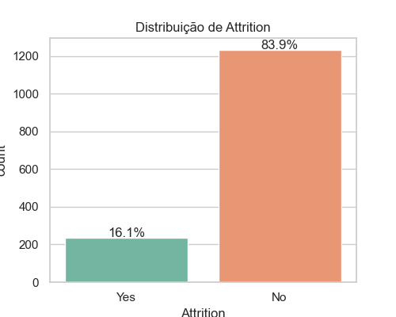
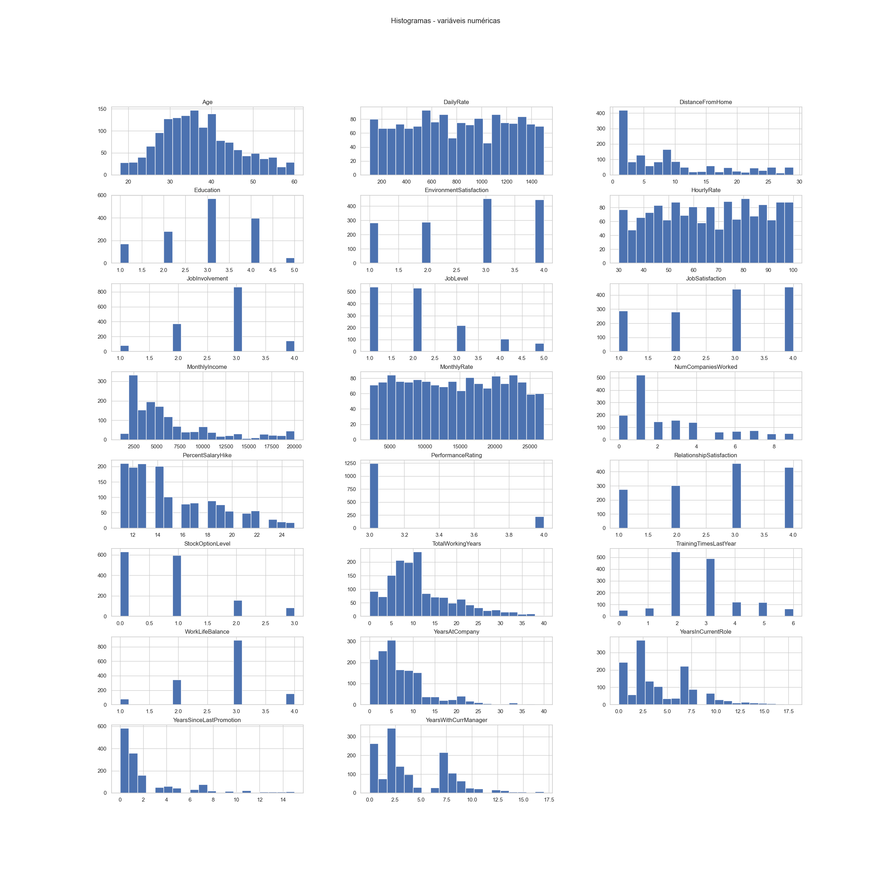
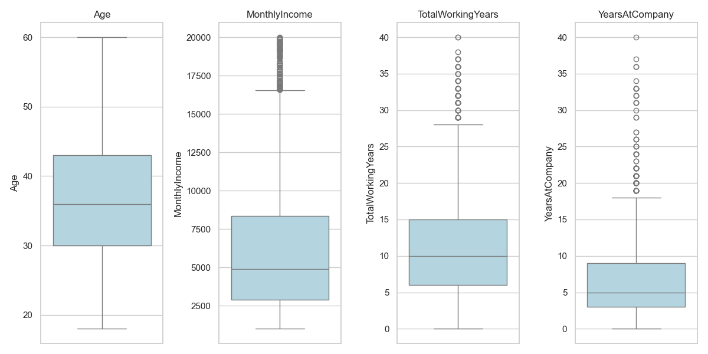
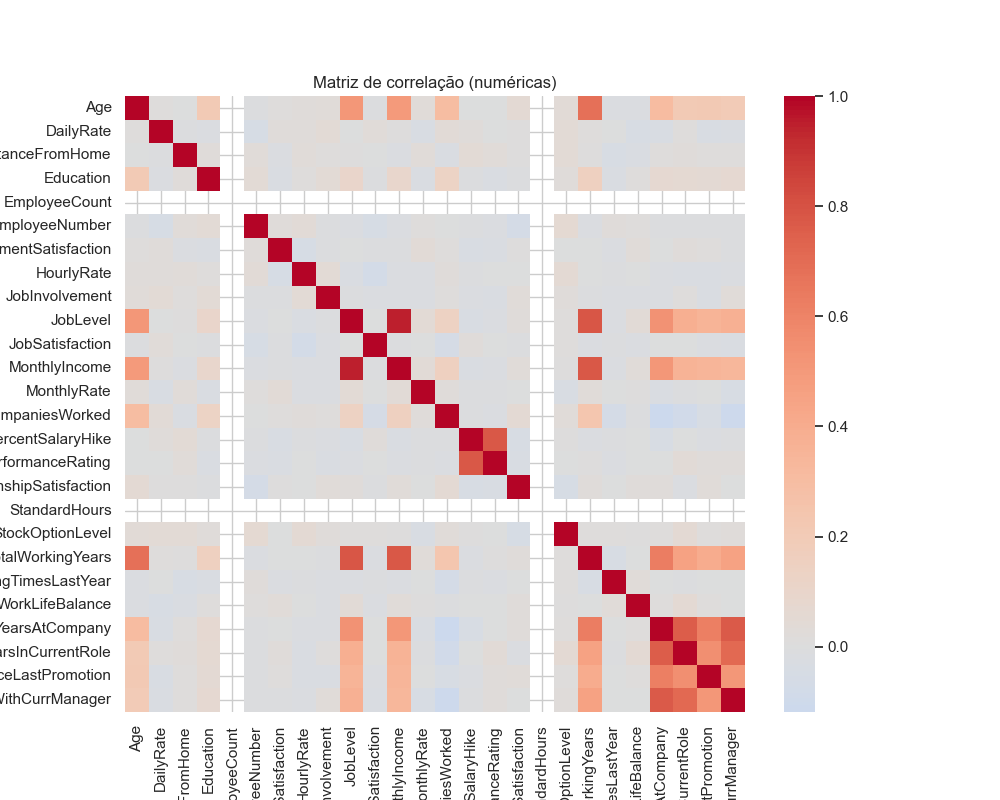
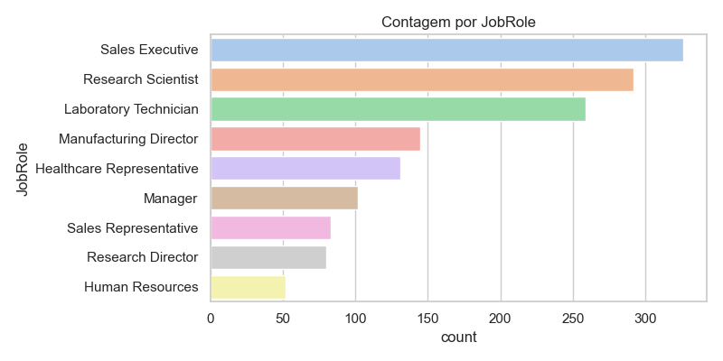
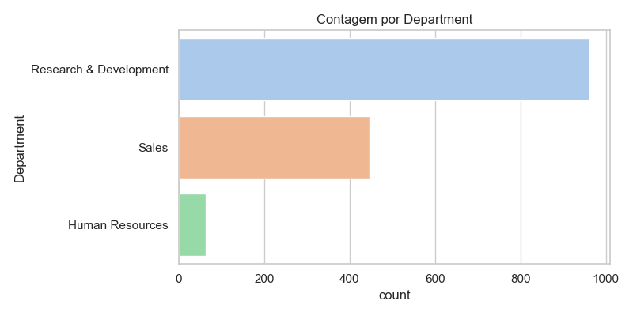
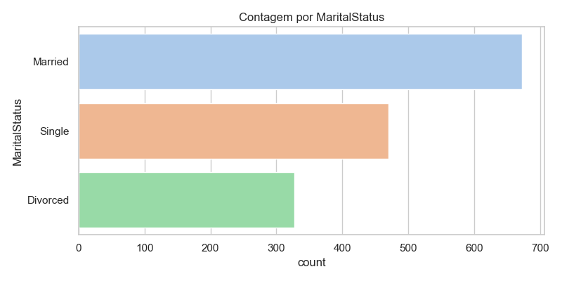
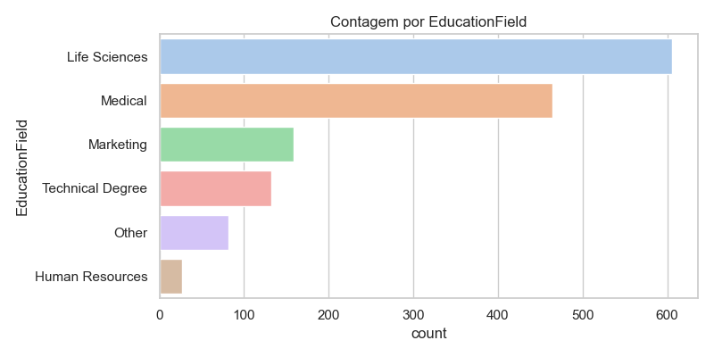
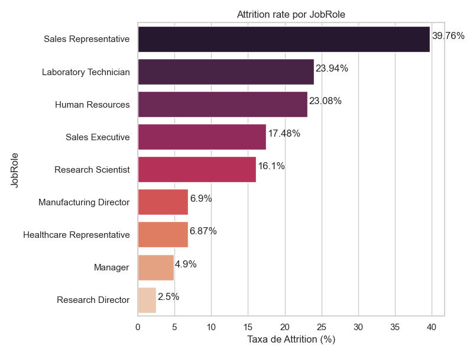

---
hide:
- toc
---

# 01 - Exploração dos Dados

## Objetivo

- Entender rapidamente a estrutura do dataset, as distribuições das variáveis, identificar problemas (valores faltantes, outliers, desbalanceamento) e apontar features promissoras para modelagem.

## Resumo executivo

- Total de registros: **1.470**

- Proporção de Attrition (completo): **1.235 No / 235 Yes** (≈ **84,0%** No / **16,0%** Yes)

- Conjunto de teste (20% estratificado): **294** registros (247 No / 47 Yes)

- Número de features após pré-processamento (imputação + one-hot): **51**

Esses números orientam escolhas de modelagem (ex.: cuidado com classes desbalanceadas e preferência por métricas que penalizem a classe minoritária — F1, recall para `Yes`).

## Estatísticas e observações principais

- Algumas variáveis numéricas apresentam alta assimetria e amplitude (ex.: `MonthlyIncome`, `DailyRate`), portanto aplicamos imputação por mediana e `StandardScaler`.

- Variáveis que se destacaram nas análises iniciais de importância: **TotalWorkingYears**, **MonthlyIncome**, **HourlyRate**, **Age** (ver seção de visualização para gráfico de importâncias).

- A presença de muitas categorias levou ao uso de One-Hot Encoding, resultando em 51 features finais.

> Nota: análise detalhada de valores faltantes e outliers está disponível no notebook `arvore_decisao.ipynb` — aqui apresentamos o resumo e os indicadores mais relevantes para a modelagem.

## Visualizações geradas

- `imagens/attrition_distribution.png` — distribuição do alvo `Attrition` com percentuais.

- `imagens/histogramas_numericas.png` — histogramas das variáveis numéricas.

- `imagens/boxplots_numericas.png` — boxplots para `Age`, `MonthlyIncome`, `TotalWorkingYears`, `YearsAtCompany`.

- `imagens/correlation_heatmap.png` — heatmap da correlação entre variáveis numéricas.

- `imagens/count_jobrole.png`, `imagens/count_department.png`, `imagens/count_maritalstatus.png`, `imagens/count_educationfield.png` — contagens por categoria.

- `imagens/attrition_rate_by_jobrole.png` — taxa de attrition por `JobRole`.

### Visualizações detalhadas

#### Distribuição do alvo (`Attrition`)

Explicação: Mostra o desbalanceamento (≈16% "Yes"). Isso reforça a necessidade de olhar métricas além de acurácia (ex.: recall da classe positiva) e considerar estratégias como ajuste de classe, penalização ou threshold tuning.

#### Histogramas das variáveis numéricas

Explicação: Evidenciam assimetrias fortes em `MonthlyIncome` e dispersão em `DailyRate`/`MonthlyRate`. A padronização (z-score) mitiga escalas diversas e facilita algoritmos sensíveis a escala (ainda que árvores sejam menos afetadas, o pipeline mantém consistência entre modelos comparados).

#### Boxplots selecionados

Explicação: Sugerem presença de outliers especialmente em `MonthlyIncome` e `TotalWorkingYears`. Optou-se por não removê-los porque: (1) são plausíveis (senioridade/tempo de casa), (2) árvore de decisão é robusta a outliers.

#### Heatmap de correlação numérica

Explicação: Correlações moderadas entre `YearsAtCompany`, `YearsInCurrentRole`, `YearsWithCurrManager` e `YearsSinceLastPromotion` indicam possível redundância parcial. A árvore lida bem com isso, mas em modelos lineares poderíamos aplicar seleção ou regularização.

#### Contagem por `JobRole`

Explicação: Papéis como "Sales Executive" e "Research Scientist" dominam a amostra. Papéis minoritários podem ter variação maior nas métricas; interpretar resultados por subgrupos requer cuidado.

#### Contagem por `Department`

Explicação: Forte predominância de `Research & Development`. Isso influencia a representatividade de padrões de attrition — comparações entre departamentos devem considerar tamanhos desiguais.

#### Contagem por `MaritalStatus`

Explicação: Distribuição relativamente equilibrada entre categorias, sem necessidade imediata de reagrupamento.

#### Contagem por `EducationField`

Explicação: `Life Sciences` e `Medical` concentram a maior parte. Campos raros permanecem como dummies individuais (One-Hot) graças ao `handle_unknown='ignore'` do encoder.

#### Taxa de attrition por `JobRole`

Explicação: Papéis com maior taxa de saída (ex.: funções comerciais/específicas) podem orientar ações de retenção. Esses padrões motivam a inclusão de interações indiretas via árvore (divisões condicionais) em vez de criar manualmente features combinadas.

> Caso alguma imagem não apareça: confirme se o diretório `docs/arvore_decisao/imagens` está versionado e se não há diferenças de maiúsculas/minúsculas nos nomes.

## Trecho de código (início da exploração)

```python
# Carregar dados e visualizar
import pandas as pd
import seaborn as sns
import matplotlib.pyplot as plt

df = pd.read_csv('funcionarios.csv')
print('shape:', df.shape)
print(df['Attrition'].value_counts())

# Plot distribuição do alvo
ax = sns.countplot(x='Attrition', data=df, palette='Set2')
# Ex.: plt.savefig('imagens/attrition_distribution.png', dpi=150, bbox_inches='tight')
```

