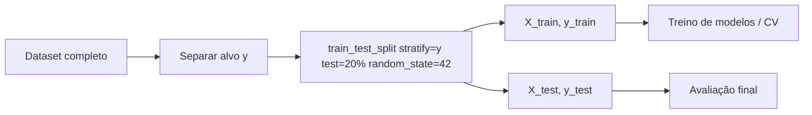

---
hide:
- toc
---

# 03 - Divisão Treino / Teste

## Objetivo

Garantir uma separação reprodutível e estratificada (preservando proporção de `Attrition`) para avaliação justa do modelo.

## Parâmetros adotados

| Parâmetro | Valor | Justificativa |
|-----------|-------|---------------|
| `test_size` | 0.20 | Equilíbrio entre dados de treino suficientes e amostra de teste robusta (≈294 linhas). |
| `stratify=y` | Sim | Mantém proporção 84% / 16% (classe desbalanceada). |
| `random_state` | 42 | Reprodutibilidade dos experimentos e dos artefatos salvos. |

## Código principal

```python
from sklearn.model_selection import train_test_split

X_train, X_test, y_train, y_test = train_test_split(
	X, y,
	test_size=0.20,
	stratify=y,
	random_state=42
)

print('Treino:', X_train.shape, 'Teste:', X_test.shape)
```

## Contagens e distribuição

Total original: **1.470** registros

| Conjunto | Registros | Attrition=No | Attrition=Yes | % Yes |
|----------|-----------|--------------|---------------|-------|
| Treino (80%) | 1.176 | 988 | 188 | 16.0% |
| Teste (20%)  | 294   | 247 | 47  | 16.0% |
| Total        | 1.470 | 1.235 | 235 | 16.0% |

Verificação (exemplo de código):

```python
import pandas as pd
train_rate = y_train.mean()
test_rate = y_test.mean()
print(f"Taxa Yes treino: {train_rate:.4f} | Taxa Yes teste: {test_rate:.4f}")
```

Saída esperada (aprox.):

```
Taxa Yes treino: 0.1598 | Taxa Yes teste: 0.1599
```

## Arquivos gerados

- `X_train_arvore.csv`, `X_test_arvore.csv`
- `y_train_arvore.csv`, `y_test_arvore.csv`

São úteis para reproduzir apenas a etapa de modelagem sem refazer o split (controle de versões / experimentos rápidos).

## Diagrama (alto nível)



## Boas práticas aplicadas

1. Estratificação evita viés de distribuição — fundamental em cenários desbalanceados.

2. `random_state` documentado assegura replicabilidade de métricas.

3. Separação feita antes de qualquer transformação que "aprenda" parâmetros (evita vazamento de informação, mesmo usando pipeline que encaixa apenas no treino).

4. Tamanho de teste suficiente para intervalos de confiança razoáveis (~47 positivos no teste).

## Possíveis extensões

| Cenário | Ação sugerida | Observação |
|---------|---------------|------------|
| Mais instabilidade em métricas | Aumentar `test_size` ou usar validação cruzada estratificada para reporting | Custo: menos dados de treino bruto. |
| Muito poucos positivos | Repetir split com `stratify` mantendo random_state ou usar KFold estratificado com agregação | Mitiga variância. |
| Benchmarks múltiplos | Criar split adicional (validação holdout) | Útil ao comparar vários modelos sem tocar no teste final. |

