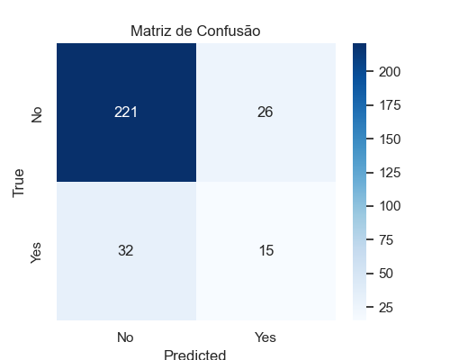
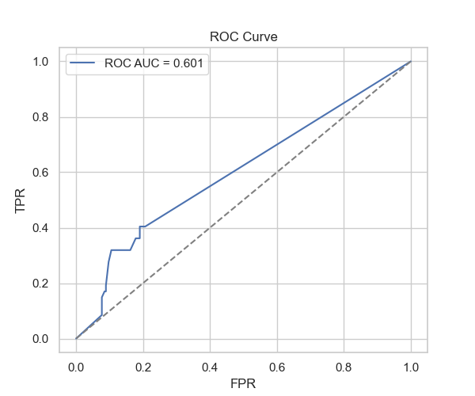

# 05 - Avaliação

Objetivo

- Avaliar o modelo no conjunto de teste usando métricas (Accuracy, Precision, Recall, F1), matriz de confusão e ROC AUC quando aplicável.

Gráficos e arquivos

- `imagens/confusion_matrix.png` — matriz de confusão.
- `imagens/roc_curve.png` — curva ROC (se `predict_proba` estiver disponível).
- `classification_report_test_arvore.csv` — relatório de classificação em CSV.

Trechos de código relevantes

```python
# Prever e calcular métricas
from sklearn.metrics import accuracy_score, precision_score, recall_score, f1_score, classification_report, confusion_matrix, roc_auc_score, roc_curve

y_pred = best.predict(X_test)
acc = accuracy_score(y_test, y_pred)
prec = precision_score(y_test, y_pred, zero_division=0)
rec = recall_score(y_test, y_pred, zero_division=0)
f1 = f1_score(y_test, y_pred, zero_division=0)
print('F1:', f1)

# Matriz de confusão e salvar imagem
cm = confusion_matrix(y_test, y_pred)
# (plot e salvamento)

# Salvar classification report
report_dict = classification_report(y_test, y_pred, output_dict=True, zero_division=0)
report_df = pd.DataFrame(report_dict).transpose()
report_df.to_csv('classification_report_test_arvore.csv')
```



