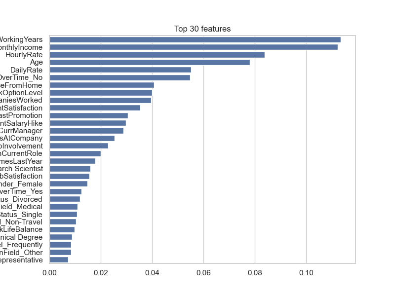
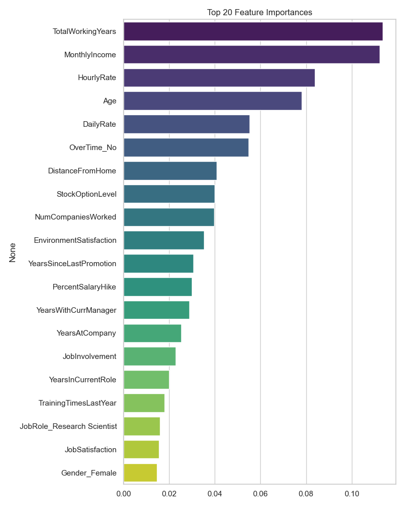
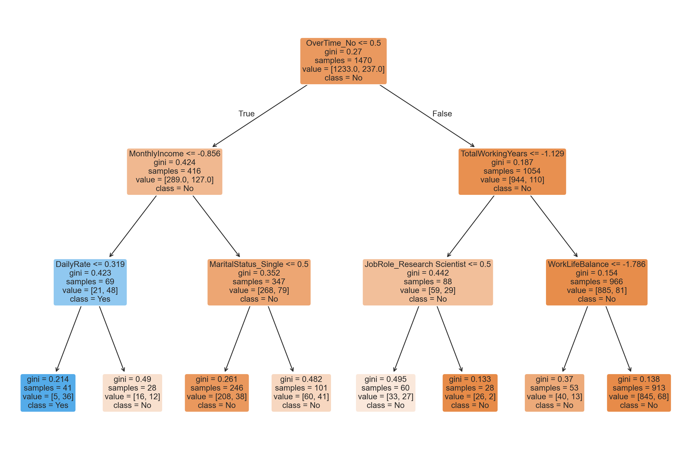
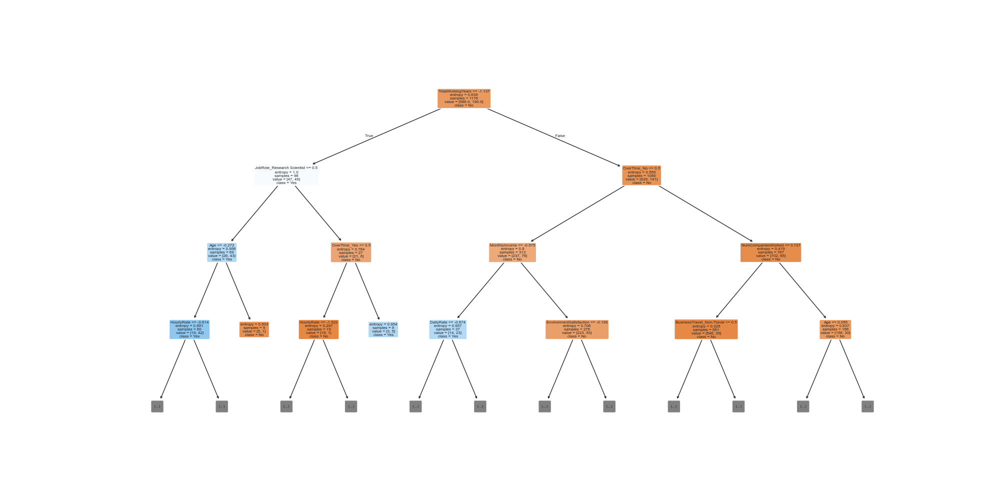

---
hide:
- toc
---

# 06 - Visualização

Objetivo

- Fornecer visualizações legíveis da nossa árvore de decisão e da árvore completa, e exportar regras em texto.

Imagens

- `imagens/arvore_reduzida.png` — nossa árvore de decisão para apresentação.
- `imagens/decision_tree.png` — visualização da árvore completa (cortada a uma profundidade para visualização).
- `imagens/feature_importances.png` e `imagens/top20_feature_importances.png` — importâncias das features estimadas pelo classificador.

Trechos de código relevantes

```python
# Treinar nossa árvore de decisão (já salva como imagem)
from sklearn.tree import DecisionTreeClassifier, plot_tree, export_text
clf_small = DecisionTreeClassifier(max_depth=3, min_samples_split=20, random_state=42)
clf_small.fit(X_proc_sample, y.values)

# Salvar plot e regras
plot_tree(clf_small, feature_names=feature_names, class_names=['No','Yes'], filled=True, rounded=True, fontsize=10)
# salvar em imagens/arvore_reduzida.png
rules = export_text(clf_small, feature_names=list(feature_names))
with open('arvore_reduzida_rules.txt', 'w', encoding='utf-8') as f:
    f.write(rules)
```

Importâncias de features (resumo)


As importâncias de features calculadas pelo classificador (valores exatos):

- TotalWorkingYears: 0.11360343704818977 — interpretação: trabalhadores com mais anos totais tendem a ter menor propensão a sair, sendo uma das variáveis mais decisivas.
- MonthlyIncome: 0.1122885302346584 — interpretação: renda mensal é um forte indicador; salários muito baixos ou discrepantes podem aumentar risco.
- HourlyRate: 0.08390738791873216 — interpretação: taxa horária contribui para a distinção entre perfis, especialmente em combinação com OverTime.
- Age: 0.07804393771824449 — interpretação: idade correlaciona-se com senioridade e estabilidade.
- DailyRate: 0.05517409482706958 — interpretação: embora menos importante que as anteriores, ainda influencia algumas divisões da árvore.

Outras features com impacto relevante (valores exatos):

- OverTime_No: 0.05478759362813149
- DistanceFromHome: 0.04077376989027586
- StockOptionLevel: 0.04002360705732124
- NumCompaniesWorked: 0.03971037825165706
- EnvironmentSatisfaction: 0.03536961977104849

Justificativa e ação sugerida

- Como `TotalWorkingYears` e `MonthlyIncome` aparecem no topo, recomenda-se priorizar análises e ações relacionadas à retenção por faixa salarial e histórico total de carreira (ex.: programas de retenção para profissionais com X anos de experiência e baixa remuneração relativa).
- `OverTime` (tanto `Yes` quanto `No`) aparece entre as features com importância: combinar informação de horas extras com remuneração (HourlyRate/MonthlyIncome) pode melhorar a sensibilidade do modelo.

Essas variáveis devem ser priorizadas na interpretação dos nós da árvore e em possíveis ações de negócio (por exemplo, políticas salariais, análise de jornada e incentivos).

Regras exportadas

- As regras da árvore reduzida estão em `imagens/arvore_reduzida_rules.txt` (texto com estrutura de decisão). Esse arquivo apresenta divisões simples como `OverTime`, `MonthlyIncome`, `DailyRate` e `TotalWorkingYears` nas regras mais relevantes.





Visualização incorporada



