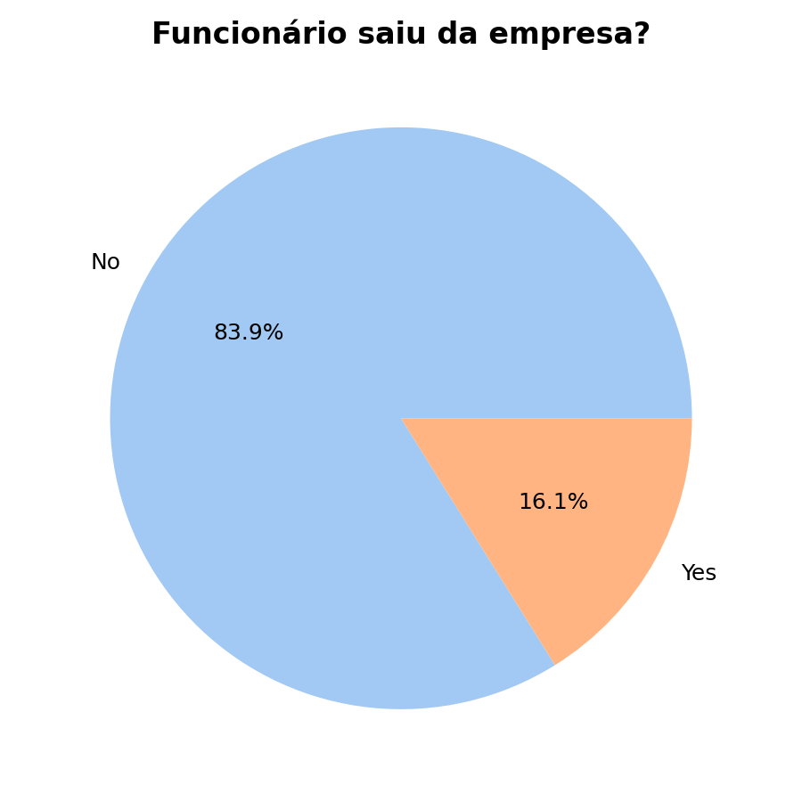
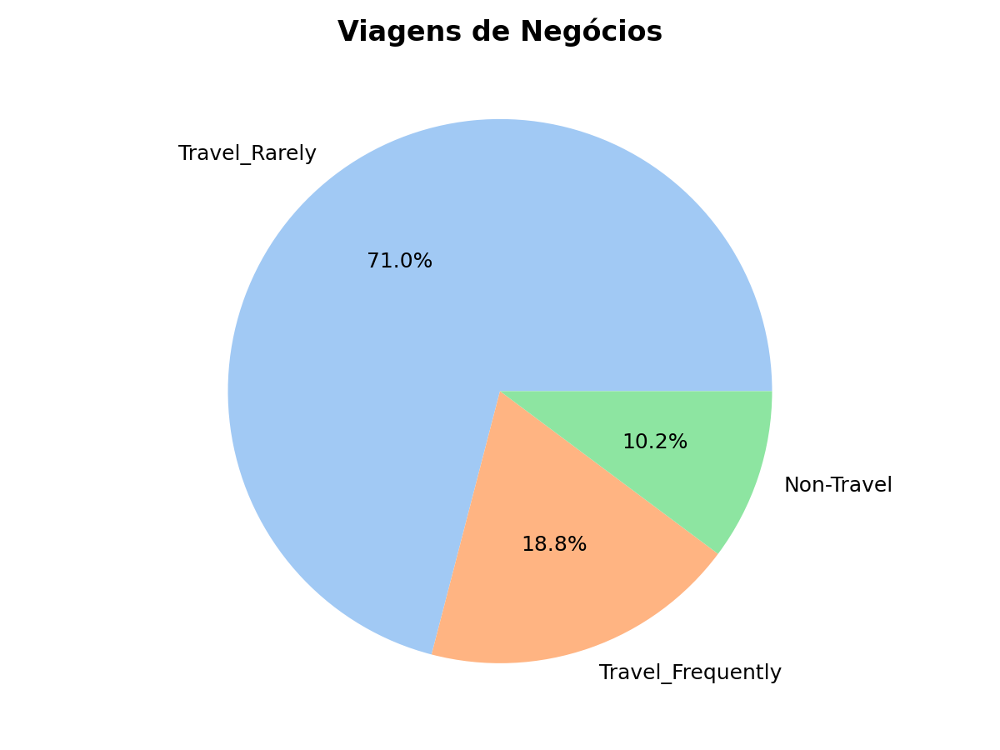
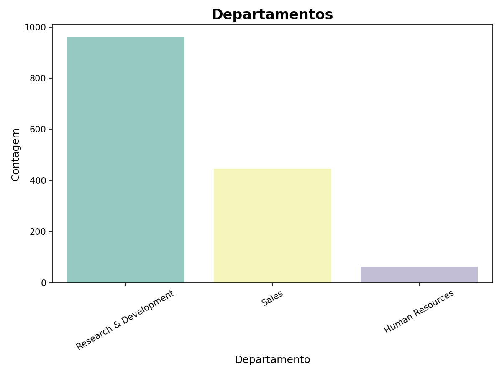
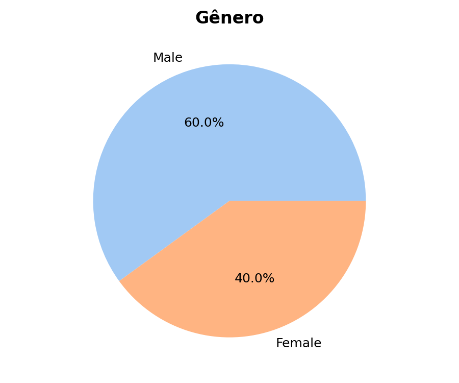
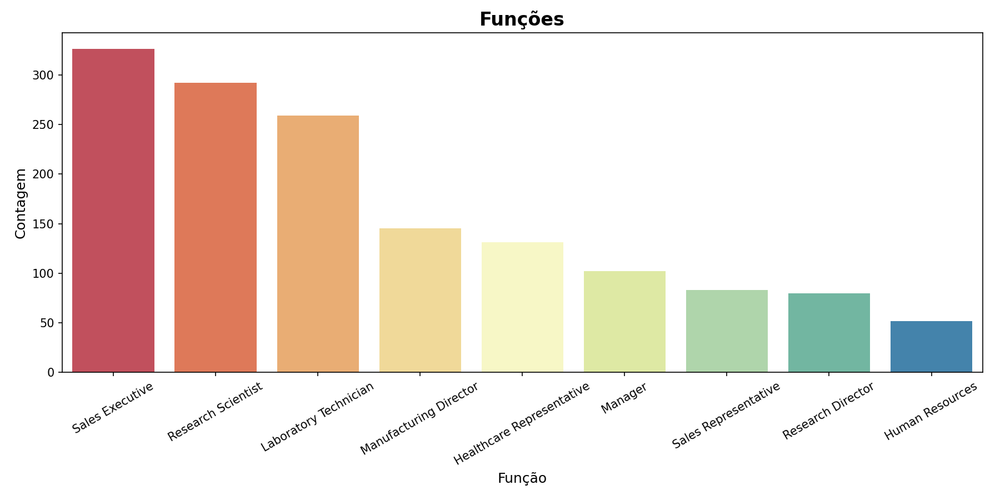
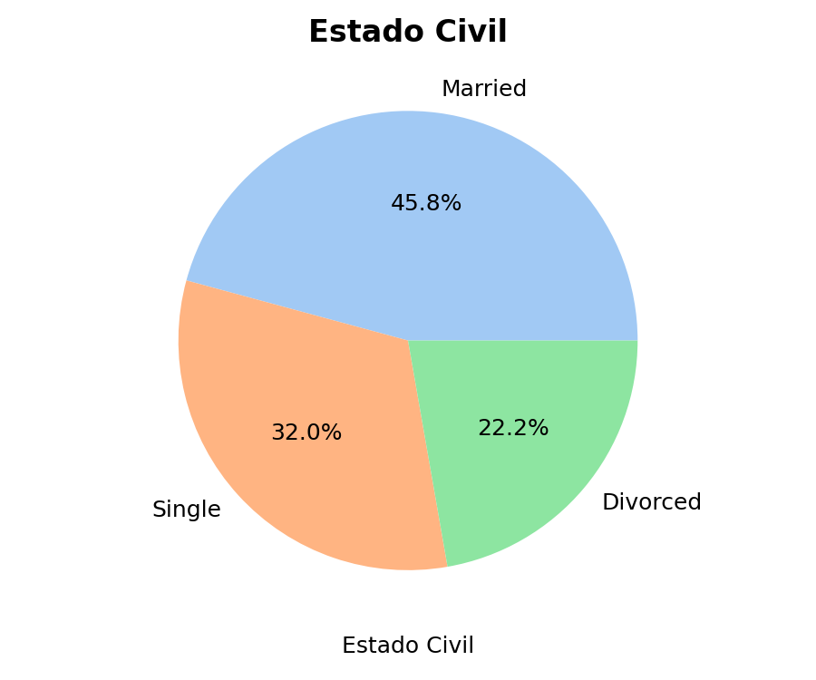
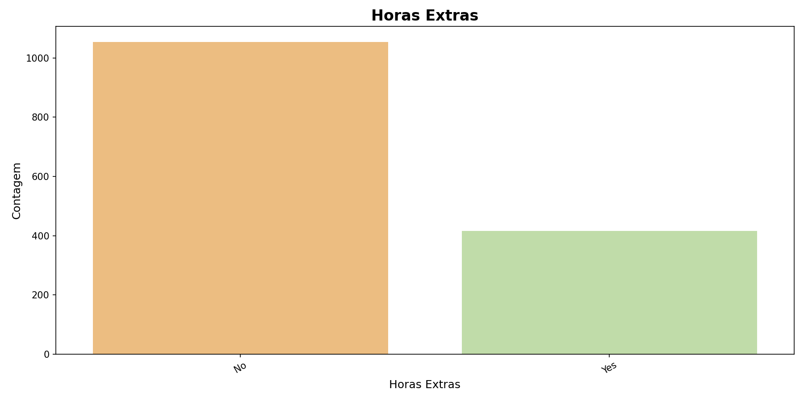

# Projeto

## Objetivo

Nosso objetivo é entender o por quê os funcionários deixam a empresa, e tentar prever quais funcionários estão propensos a sair, para que medidas possam ser tomadas para evitar a rotatividade.

**Hipótese:** Funcionários que estão insatisfeitos com o ambiente de trabalho, salário ou oportunidades de crescimento são mais propensos a deixar a empresa.

## Exploração dos Dados

Os dados foram coletados de uma empresa fictícia e incluem informações sobre os funcionários, como idade, salário, satisfação no trabalho, entre outros. A variável alvo é "Attrition", que indica se o funcionário deixou a empresa (Yes) ou não (No).

A partir desta análise inicial, podemos perceber que não temos valores nulos e que a maioria das variáveis são numéricas, o que facilita a aplicação de algoritmos de machine learning. Porém, teremos que tratar as variáveis categóricas com as técnicas de encoding.

=== "Output"

    ``` 
        Age Attrition  ... YearsSinceLastPromotion  YearsWithCurrManager
    0   41       Yes  ...                       0                     5
    1   49        No  ...                       1                     7
    2   37       Yes  ...                       0                     0
    3   33        No  ...                       3                     0
    4   27        No  ...                       2                     2

    [5 rows x 35 columns]

    Informações do dataset:
    <class 'pandas.core.frame.DataFrame'>
    RangeIndex: 1470 entries, 0 to 1469
    Data columns (total 35 columns):
    #   Column                    Non-Null Count  Dtype 
    ---  ------                    --------------  ----- 
    0   Age                       1470 non-null   int64 
    1   Attrition                 1470 non-null   object
    2   BusinessTravel            1470 non-null   object
    3   DailyRate                 1470 non-null   int64 
    4   Department                1470 non-null   object
    5   DistanceFromHome          1470 non-null   int64 
    6   Education                 1470 non-null   int64 
    7   EducationField            1470 non-null   object
    8   EmployeeCount             1470 non-null   int64 
    9   EmployeeNumber            1470 non-null   int64 
    10  EnvironmentSatisfaction   1470 non-null   int64 
    11  Gender                    1470 non-null   object
    12  HourlyRate                1470 non-null   int64 
    13  JobInvolvement            1470 non-null   int64 
    14  JobLevel                  1470 non-null   int64 
    15  JobRole                   1470 non-null   object
    16  JobSatisfaction           1470 non-null   int64 
    17  MaritalStatus             1470 non-null   object
    18  MonthlyIncome             1470 non-null   int64 
    19  MonthlyRate               1470 non-null   int64 
    20  NumCompaniesWorked        1470 non-null   int64 
    21  Over18                    1470 non-null   object
    22  OverTime                  1470 non-null   object
    23  PercentSalaryHike         1470 non-null   int64 
    24  PerformanceRating         1470 non-null   int64 
    25  RelationshipSatisfaction  1470 non-null   int64 
    26  StandardHours             1470 non-null   int64 
    27  StockOptionLevel          1470 non-null   int64 
    28  TotalWorkingYears         1470 non-null   int64 
    29  TrainingTimesLastYear     1470 non-null   int64 
    30  WorkLifeBalance           1470 non-null   int64 
    31  YearsAtCompany            1470 non-null   int64 
    32  YearsInCurrentRole        1470 non-null   int64 
    33  YearsSinceLastPromotion   1470 non-null   int64 
    34  YearsWithCurrManager      1470 non-null   int64 
    dtypes: int64(26), object(9)
    memory usage: 402.1+ KB
    None

    Estatísticas descritivas do dataset:
                Age    DailyRate  ...  YearsSinceLastPromotion  YearsWithCurrManager
    count  1470.000000  1470.000000  ...              1470.000000           1470.000000
    mean     36.923810   802.485714  ...                 2.187755              4.123129
    std       9.135373   403.509100  ...                 3.222430              3.568136
    min      18.000000   102.000000  ...                 0.000000              0.000000
    25%      30.000000   465.000000  ...                 0.000000              2.000000
    50%      36.000000   802.000000  ...                 1.000000              3.000000
    75%      43.000000  1157.000000  ...                 3.000000              7.000000
    max      60.000000  1499.000000  ...                15.000000             17.000000

    [8 rows x 26 columns]

    Valores nulos por coluna:
    Age                         0
    Attrition                   0
    BusinessTravel              0
    DailyRate                   0
    Department                  0
    DistanceFromHome            0
    Education                   0
    EducationField              0
    EmployeeCount               0
    EmployeeNumber              0
    EnvironmentSatisfaction     0
    Gender                      0
    HourlyRate                  0
    JobInvolvement              0
    JobLevel                    0
    JobRole                     0
    JobSatisfaction             0
    MaritalStatus               0
    MonthlyIncome               0
    MonthlyRate                 0
    NumCompaniesWorked          0
    Over18                      0
    OverTime                    0
    PercentSalaryHike           0
    PerformanceRating           0
    RelationshipSatisfaction    0
    StandardHours               0
    StockOptionLevel            0
    TotalWorkingYears           0
    TrainingTimesLastYear       0
    WorkLifeBalance             0
    YearsAtCompany              0
    YearsInCurrentRole          0
    YearsSinceLastPromotion     0
    YearsWithCurrManager        0
    dtype: int64
    ```

=== "Code"

    ```python
        import pandas as pd
        import matplotlib.pyplot as plt
        import seaborn as sns

        df = pd.read_csv('/home/mgabriel4/Documentos/GitHub/machine-learning-grupo4/data/funcionarios.csv')

        print('\nPrimeiras 5 linhas do dataset:')
        print(df.head())

        print('\nInformações do dataset:')
        print(df.info())

        print('\nEstatísticas descritivas do dataset:')
        print(df.describe())

        print('\nValores nulos por coluna:')
        print(df.isnull().sum())

        # Visualizações
        plt.figure(figsize=(8, 6))
        df['BusinessTravel'].value_counts().plot.pie(autopct='%1.1f%%', colors=sns.color_palette('pastel'), textprops={'fontsize': 12})
        plt.title('Viagens de Negócios', fontsize=16, fontweight='bold')
        plt.ylabel('')
        plt.xticks(rotation=30)
        plt.tight_layout()
        plt.savefig('./docs/classes/decision_tree/img/business_travel.png', dpi=150)
        plt.show()

        plt.figure(figsize=(6, 6))
        df['Attrition'].value_counts().plot.pie(autopct='%1.1f%%', colors=sns.color_palette('pastel'), textprops={'fontsize': 12})
        plt.title('Funcionário saiu da empresa?', fontsize=16, fontweight='bold')
        plt.ylabel('')
        plt.tight_layout()
        plt.savefig('./docs/classes/decision_tree/img/attrition_pie.png', dpi=150)
        plt.show()

        plt.figure(figsize=(8, 6))
        sns.countplot(x='Department', data=df, palette='Set3', order=df['Department'].value_counts().index)
        plt.title('Departamentos', fontsize=16, fontweight='bold')
        plt.xlabel('Departamento', fontsize=12)
        plt.ylabel('Contagem', fontsize=12)
        plt.xticks(rotation=30)
        plt.tight_layout()
        plt.savefig('./docs/classes/decision_tree/img/department.png', dpi=150)
        plt.show()

        plt.figure(figsize=(6, 5))
        df['Gender'].value_counts().plot.pie(autopct='%1.1f%%', colors=sns.color_palette('pastel'), textprops={'fontsize': 12})
        plt.title('Gênero', fontsize=16, fontweight='bold')
        plt.ylabel('')
        plt.tight_layout()
        plt.savefig('./docs/classes/decision_tree/img/gender.png', dpi=150)
        plt.show()

        plt.figure(figsize=(12, 6))
        sns.countplot(x='JobRole', data=df, palette='Spectral', order=df['JobRole'].value_counts().index)
        plt.title('Funções', fontsize=16, fontweight='bold')
        plt.xlabel('Função', fontsize=12)
        plt.ylabel('Contagem', fontsize=12)
        plt.xticks(rotation=30)
        plt.tight_layout()
        plt.savefig('./docs/classes/decision_tree/img/jobrole.png', dpi=150)
        plt.show()

        plt.figure(figsize=(6, 5))
        df['MaritalStatus'].value_counts().plot.pie(autopct='%1.1f%%', colors=sns.color_palette('pastel'), textprops={'fontsize': 12})
        plt.title('Estado Civil', fontsize=16, fontweight='bold')
        plt.xlabel('Estado Civil', fontsize=12)
        plt.ylabel('')
        plt.tight_layout()
        plt.savefig('./docs/classes/decision_tree/img/marital_status.png', dpi=150)
        plt.show()

        plt.figure(figsize=(12, 6))
        sns.countplot(x='OverTime', data=df, palette='Spectral', order=df['OverTime'].value_counts().index)
        plt.title('Horas Extras', fontsize=16, fontweight='bold')
        plt.xlabel('Horas Extras', fontsize=12)
        plt.ylabel('Contagem', fontsize=12)
        plt.xticks(rotation=30)
        plt.tight_layout()
        plt.savefig('./docs/classes/decision_tree/img/overtime.png', dpi=150)
        plt.show()
    ```

---

### Gráficos gerados

Abaixo estão os gráficos gerados a partir da análise exploratória dos dados (EDA):


Este gráfico de pizza ilustra a proporção de funcionários que deixaram a empresa em comparação com aqueles que permaneceram. A maioria dos funcionários permaneceu na empresa, mas uma parcela significativa saiu, o que pode indicar áreas para melhoria na retenção de funcionários. Este gráfico é crucial para entendermos a variável target do nosso modelo de machine learning.


Este gráfico de pizza mostra a distribuição dos tipos de viagens de negócios entre os funcionários. A maioria dos funcionários não viaja a negócios, enquanto uma pequena porcentagem viaja ocasionalmente ou frequentemente.


Este gráfico de barras mostra a distribuição de funcionários por departamento. A maioria dos funcionários está concentrada em alguns departamentos, enquanto outros têm poucos funcionários. Isso pode ajudar a identificar áreas com alta ou baixa alocação de recursos.


Este gráfico de pizza ilustra a distribuição de gênero entre os funcionários. A maioria dos funcionários é do gênero masculino, mas há uma representação significativa do gênero feminino. Isso pode ajudar a entender a diversidade de gênero na empresa.


Este gráfico de barras mostra a distribuição dos cargos dos funcionários. A maioria dos funcionários ocupa cargos como Representante de Vendas e Pesquisador de Laboratório, enquanto outros cargos são menos comuns. Isso pode fornecer insights sobre a estrutura organizacional da empresa.


Este gráfico de pizza ilustra a distribuição do estado civil entre os funcionários. A maioria dos funcionários é casada, mas há uma representação significativa de funcionários solteiros e divorciados. Isso pode ajudar a entender a dinâmica familiar dos funcionários.


Este gráfico de barras mostra a distribuição de horas extras entre os funcionários. A maioria dos funcionários não faz horas extras, enquanto uma pequena porcentagem trabalha horas extras regularmente. Isso pode indicar áreas de sobrecarga de trabalho.

## Pré-processamento dos Dados

Antes de aplicar os algoritmos de machine learning, é necessário realizar o pré-processamento dos dados. Isso inclui:

* Tratamento de valores ausentes (se houver)
* Codificação de variáveis categóricas (One-Hot Encoding, Label Encoding)
* Normalização ou padronização de variáveis numéricas (se necessário)
* Divisão dos dados em conjuntos de treino e teste
* Seleção de features
