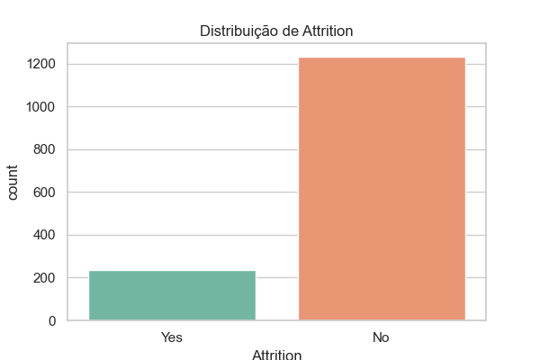

# 01 - Exploração dos Dados (K-Means)

Objetivo

- Entender a estrutura do dataset `funcionarios.csv`, detectar valores faltantes e visualizar distribuições das variáveis que serão candidatas ao clustering.

Gráficos gerados




Trechos de código

```python
import pandas as pd
import seaborn as sns
import matplotlib.pyplot as plt

df = pd.read_csv('funcionarios.csv')
print(df.shape)
print(df.describe().T)

# Plot distribuição do alvo
sns.countplot(x='Attrition', data=df, palette='Set2')
plt.savefig('imagens/attrition_distribution.png')
plt.show()
```
