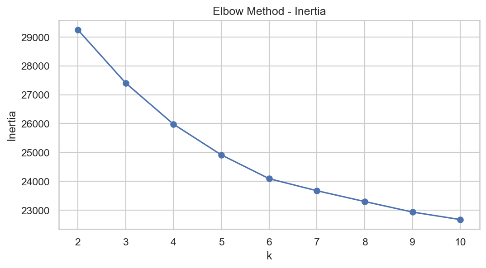
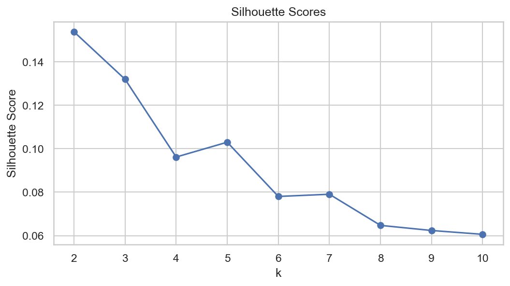

# 03 - Elbow & Silhouette

Objetivo

- Avaliar a escolha de K (número de clusters) usando métodos internos: Inertia (elbow) e Silhouette score.

Gráficos gerados




Trechos de código

```python
from sklearn.cluster import KMeans
from sklearn.metrics import silhouette_score

inertias = []
silhouettes = []
K_range = range(2,11)
for k in K_range:
    km = KMeans(n_clusters=k, random_state=42, n_init=10)
    labels = km.fit_predict(X_scaled)
    inertias.append(km.inertia_)
    silhouettes.append(silhouette_score(X_scaled, labels))

# salvar plots como kmeans_elbow.png e kmeans_silhouette.png
```

Interpretação rápida

- Inertia decresce com k; um "cotovelo" claro não foi observado no exemplo, indicando que clusters não são extremamente distintos.
- Silhouette máximo ocorreu em k=2 (≈0.15), sugerindo separação fraca.

Recomendações

- Testar k=2..4 e incluir/experimentar features categóricas para verificar melhoria nas métricas.
