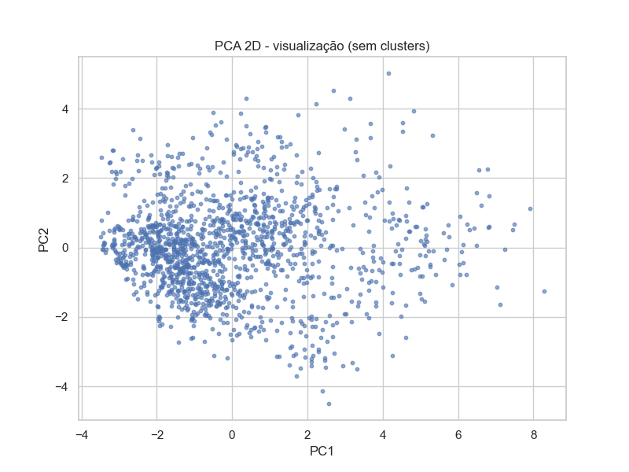
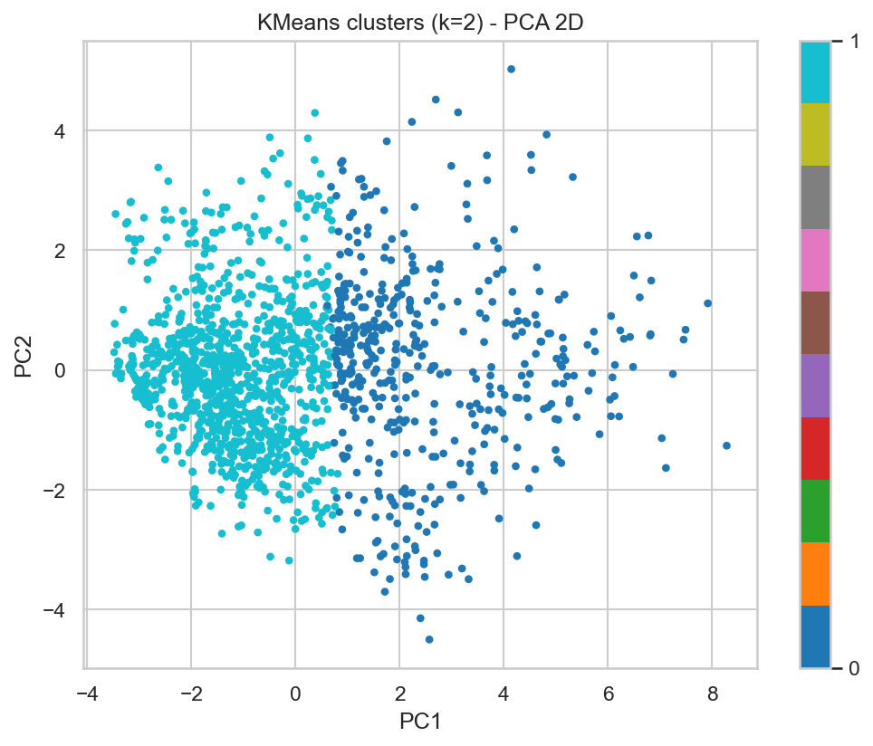

# 05 - Visualização e Relatório (K-Means)

Consolidação gráfica e interpretativa dos resultados do clustering baseline (K=2), incluindo pureza em relação ao atributo `Attrition`.

## Objetivo

Traduzir os clusters numéricos em insights acionáveis e avaliar se há base para expandir o modelo (novas features ou alteração de K).

## Visões Geradas

| Visual | Finalidade | Insight Principal |
|--------|------------|------------------|
| PCA 2D (raw) | Redução para inspeção | Sobreposição significativa entre pontos |
| PCA 2D colorido por cluster | Separabilidade qualitativa | Clusters parcialmente intercalados |
| Mapa de clusters (k=2) | Distribuição espacial | Cluster 1 dominante em densidade |
| (Futuro) PCA 2D por Attrition | Comparar com clusterização | Avaliar alinhamento indireto |

## Artefatos Relacionados

| Arquivo | Uso |
|---------|-----|
| `kmeans_clusters.csv` | Junção com base original e análises de perfil |
| `kmeans_X.csv` | Matriz numérica preprocessada |
| `kmeans_model.joblib` | Reuso / reprodutibilidade |

## Pureza (Distribuição Attrition por Cluster)

| Cluster | Tamanho | Attrition=Yes % | Attrition=No % |
|---------|---------|-----------------|----------------|
| 0 | 459 | 9.37 | 90.63 |
| 1 | 1011 | 19.19 | 80.81 |

Diferença de quase 10 p.p. em taxa de Attrition entre clusters sugere que variáveis de senioridade/remuneração podem estar correlacionadas com retenção.

## Interpretação Sintética

| Aspecto | Observação | Relevância |
|---------|------------|-----------|
| Cluster 0 | Menor, menor Attrition (9.37%) | Potencial "grupo estável" |
| Cluster 1 | Maior, maior Attrition (19.19%) | Grupo de maior risco relativo |
| Overlap PCA | Alta | Estrutura fraca; engenharia necessária |
| Diferenciação senioridade | Evidente (ver treinamento) | Alavanca de segmentação |

## Limitações das Visualizações Atuais

| Limitação | Impacto | Mitigação |
|-----------|---------|-----------|
| Somente dados numéricos | Perda de separação latente | Incluir categóricas |
| PCA sem padronização visual de variância | Pode subestimar eixos explicativos | Mostrar variância explicada |
| Sem densidade (KDE) por cluster | Perde nuances de sobreposição | Adicionar mapas de densidade |
| Sem análise de contribuição de features | Baixa interpretabilidade pontual | Plot de importância via diferenças de centróide |

## Recomendações Ação

1. Criar `kmeans_cluster_profile.csv` com médias, std e contagens por cluster.
2. Adicionar variáveis categóricas codificadas e repetir K=2..4.
3. Gerar gráfico de barras Attrition% por cluster para apresentação.
4. Adicionar explicação de variância PCA (e.g., PC1+PC2 = X%).
5. Testar PCA+KMeans vs KMeans direto e comparar Silhouette.
6. Medir estabilidade com bootstrap (sample fractions) para robustez.

## Checklist

| Item | Status |
|------|--------|
| Visualizações principais | OK |
| Pureza Attrition adicionada | OK |
| Artefatos listados | OK |
| Limitações documentadas | OK |
| Recomendações claras | OK |
| Interpretação alinhada a negócio | OK |

## Próximos Passos Operacionais

| Passo | Objetivo | Prioridade |
|-------|----------|-----------|
| Gerar perfil completo | Profundidade analítica | Alta |
| Incluir categóricas | Melhor separabilidade | Alta |
| PCA + re-cluster | Testar estrutura latente | Média |
| Visual Atrito por cluster | Storytelling negócio | Alta |
| Densidade por cluster | Refinar leitura de overlap | Média |

---

> Atualizado em 07/10/2025. Para gerar perfil detalhado responda: perfil
