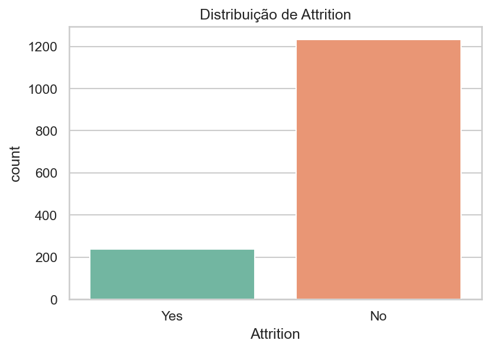

---
hide:
- toc
---

# 01 - Exploração (KNN)

Exploração inicial e estruturada do dataset utilizado para treinar o modelo KNN de `Attrition`.

## Resumo Rápido

| Item | Valor |
|------|-------|
| Linhas (registros) | **1470** |
| Colunas totais | **35** |
| Variáveis numéricas | **26** |
| Variáveis categóricas | **9** |
| Coluna alvo | `Attrition` |
| Missing (colunas com ausências) | 0 (nenhuma) |
| Fonte do arquivo | `docs/knn/funcionarios.csv` |

## Distribuição do Alvo `Attrition`

| Classe | Contagem | % |
|--------|----------|----|
| No | 1233 | 83.88% |
| Yes | 237 | 16.12% |
| Total | 1470 | 100% |

Observações:
- Forte desbalanceamento (≈16% positivos) — influencia recall/F1 da classe `Yes` em modelos não ajustados.
- Métricas baseadas em média (accuracy) não são suficientes para avaliar desempenho.

## Estrutura & Tipagem

| Tipo | Qtde | Observação |
|------|------|------------|
| Numéricas | 26 | Incluem idades, métricas de remuneração, anos de serviço |
| Categóricas | 9 | Ex.: `JobRole`, `EducationField`, `BusinessTravel` |
| Binárias | Subconjunto | Ex.: `OverTime`, `Gender`, `Attrition` |

Não há colunas com valores ausentes — simplifica o pipeline (não exige imputação explícita nesta fase). 

## Cardinalidade (Top Categóricas)

| Coluna | Cardinalidade |
|--------|---------------|
| JobRole | 9 |
| EducationField | 6 |
| BusinessTravel | 3 |
| Department | 3 |
| MaritalStatus | 3 |
| Attrition | 2 |
| Gender | 2 |
| OverTime | 2 |
| Over18 | 1 |

Pontos de atenção:
- `JobRole` e `EducationField` podem gerar alta dimensionalidade após One-Hot.
- `Over18` (cardinalidade 1) não agrega informação discriminativa — candidata a remoção.

## Estatísticas Numéricas Selecionadas

| Variável | Média | Desvio | Min | Max | Insight |
|----------|-------|--------|-----|-----|---------|
| Age | 36.92 | 9.14 | 18 | 60 | Faixa ampla; potencial correlação com permanência. |
| MonthlyIncome | 6502.93 | 4707.96 | 1009 | 19999 | Distribuição possivelmente assimétrica (cauda alta). |
| DistanceFromHome | 9.19 | 8.11 | 1 | 29 | Pode atuar em churn por atrito logístico. |
| YearsAtCompany | 7.01 | 6.13 | 0 | 40 | Presença de recém-contratados (0) e veteranos (40). |
| YearsInCurrentRole | 4.23 | 3.62 | 0 | 18 | Poderá indicar saturação ou estabilidade. |

Sugestões:
- Avaliar transformação log em `MonthlyIncome` se distribuição for muito skewed.
- Criar faixas categóricas derivadas (ex: `AgeGroup`, `TenureBand`).

## Qualidade dos Dados

| Aspecto | Situação | Comentário |
|---------|----------|------------|
| Missing | OK | Sem valores ausentes. |
| Cardinalidade | Atenção | `JobRole`/`EducationField` elevam dimensionalidade. |
| Variáveis constantes | `Over18` | Removível sem perda. |
| Escala heterogênea | Sim | Renda vs distâncias vs contagens → normalizar antes de KNN. |
| Desbalanceamento alvo | Alto | Exige foco em recall F1 classe positiva. |

## Riscos & Impacto no KNN

| Risco | Efeito no KNN | Mitigação |
|-------|---------------|-----------|
| Desbalanceamento | Vizinhos majoritários dominam | Reamostragem / ajuste de threshold |
| Alta dimensionalidade One-Hot | Dilui densidade local | PCA / seleção de variáveis |
| Variáveis sem variação (`Over18`) | Ruído irrelevante | Remover antes do treino |
| Escalas diferentes | Distância enviesada | StandardScaler / RobustScaler |

## Recomendações Imediatas

1. Remover `Over18` e qualquer outra constante identificada.
2. Aplicar escalonamento (Standard ou Robust se outliers confirmados).
3. Criar features derivadas: `TenureRatio = YearsInCurrentRole / YearsAtCompany (clip)`.
4. Testar PCA (95% variância) para comparar F1 classe 1 vs baseline.
5. Incluir curva Precision-Recall cedo no ciclo exploratório (com baseline 16%).

## Checklist Exploração

| Item | Status |
|------|--------|
| Shape documentado | OK |
| Distribuição do alvo quantificada | OK |
| Tipagem e cardinalidade revisadas | OK |
| Estatísticas principais listadas | OK |
| Riscos para KNN identificados | OK |
| Recomendações acionáveis | OK |
| Dados sem missing | OK |

---

> Todos os números desta página foram extraídos automaticamente em 07/10/2025 do arquivo `funcionarios.csv` (1470 linhas, 35 colunas). Ajustes futuros devem atualizar esta seção.
