---
hide:
- toc
---

# 05 - Visualização (KNN)

Este capítulo documenta e interpreta as principais visualizações geradas durante a análise e avaliação do modelo KNN para `Attrition`. O foco não é apenas mostrar figuras, mas extrair implicações acionáveis para melhoria do modelo e entendimento dos dados.

## Sumário das Visualizações

| Seção | Figura | Objetivo |
|-------|--------|----------|
| Distribuição do alvo | `knn_attrition_distribution.png` | Mostrar desbalanceamento (classe 1 minoritária) |
| Matriz de confusão | `knn_confusion_matrix.png` | Evidenciar padrões de erro (FN vs FP) |
| ROC | `knn_roc.png` | Avaliar separabilidade geral (sensibilidade vs 1-especificidade) |
| Precision-Recall | `knn_pr_curve.png` | Avaliar performance na classe positiva desbalanceada |
| PCA 2D | `knn_pca2d.png` | Visualizar separabilidade aproximada em projeção linear | 
| Correlação | `knn_correlation.png` | Identificar colinearidade entre variáveis numéricas |
| Distribuições univariadas | `knn_dist_*.png` | Explorar diferenças de densidade por atributo |

---

## Distribuição do Alvo

Interpretação:
- Confirma forte desbalanceamento (≈16% classe positiva). Justifica uso de métricas além de accuracy (ver F1 classe 1 no treinamento).
- Estratégias de reamostragem ou ajuste de threshold podem ser necessárias para elevar recall da classe 1.

Risco: modelos que priorizam precisão global tendem a subprever a classe 1 (observado no KNN atual).

---

## Matriz de Confusão

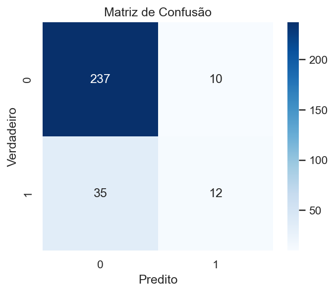

Leitura (conforme métricas do capítulo 04): predominância de Falsos Negativos (FN) em relação a Verdadeiros Positivos (TP).

Implicações:
- FN altos: custo potencial de não acionar retenção preventiva.
- FP baixos: modelo é conservador para apontar saída → há margem para mover threshold em favor de maior recall.

Ação sugerida: avaliar `weights='distance'` + ajuste de limiar sobre as probabilidades (`predict_proba`).

---

## Curvas ROC e Precision-Recall

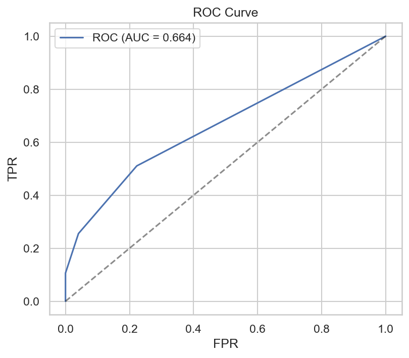
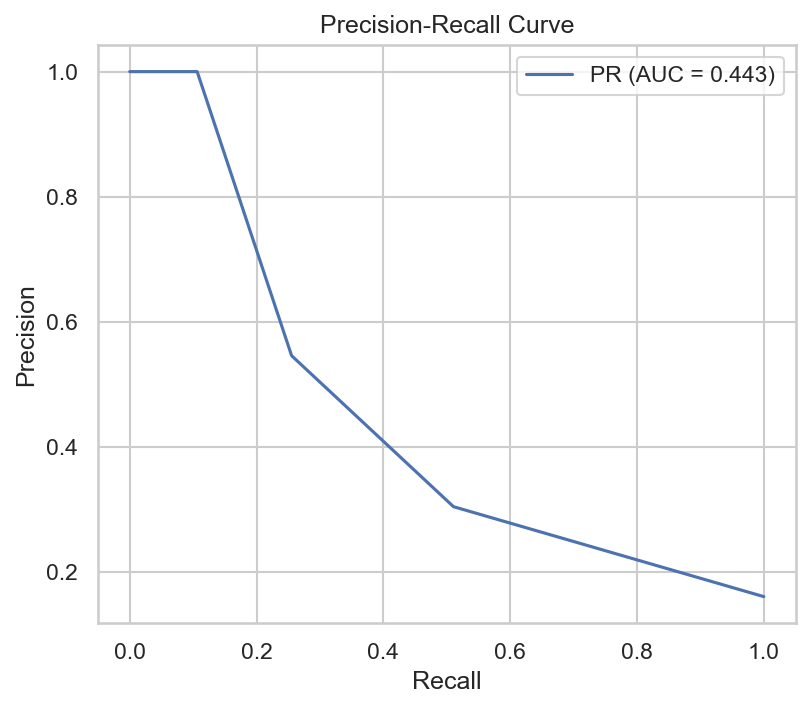

Interpretação ROC:
- Se a curva estiver próxima da diagonal em porções iniciais, o modelo tem dificuldade em separar as classes sob baixa taxa de falsos positivos.

Interpretação Precision-Recall:
- Mais informativa em cenário desbalanceado. Se a curva ficar pouco acima da linha de base (prevalência ≈ 16%), reforça dificuldade do KNN atual em identificar positivos com boa precisão.

Uso prático: selecionar ponto que atenda recall alvo (ex: ≥45%) mantendo precision ≥50% (ver KPIs definidos no treinamento).

---

## PCA 2D (Projeção)

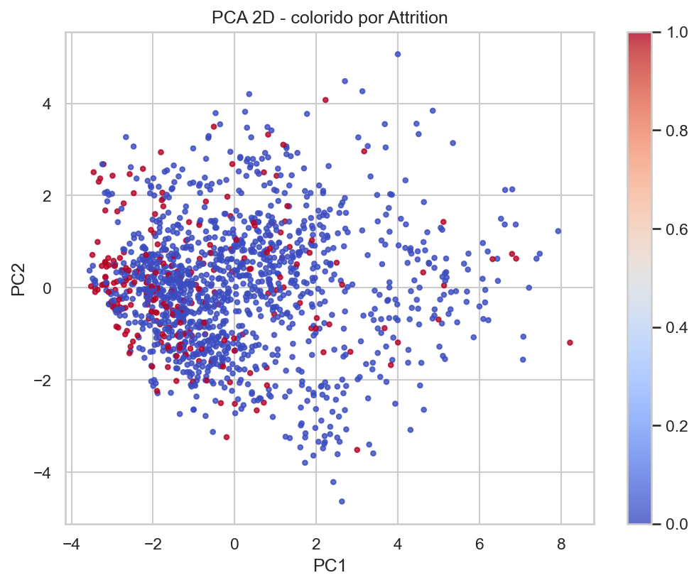

Interpretação:
- Mistura considerável das classes sugere ausência de separação linear clara nos dois primeiros componentes.
- KNN depende de proximidade local; se a densidade positiva for difusa, recall sofre.

Possíveis Ações:
- Testar redução dimensional (PCA preservando 95% da variância) para reduzir ruído esparso.
- Avaliar engenharia de atributos (agregações de tempo de serviço, interações relevantes).

---

## Correlação entre Variáveis Numéricas

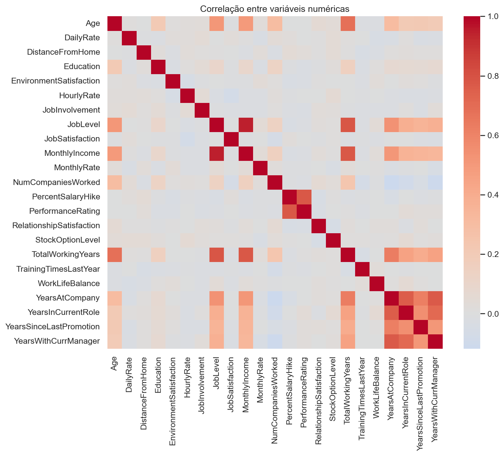

Interpretação:
- Identificar pares altamente correlacionados (ex: se houver atributos derivados de remuneração). Redução pode ajudar distância a refletir informação sem redundância.
- Alta colinearidade pode amplificar influência de grupos de atributos correlacionados na métrica de distância.

Sugestões:
1. Remover ou combinar variáveis redundantes para estabilizar vizinhanças.
2. Escalonar cuidadosamente para não superponderar variáveis com baixa variância após codificação.

---

## Distribuições Univariadas Selecionadas

Os gráficos a seguir ajudam a entender diferenças marginais de densidade por classe.

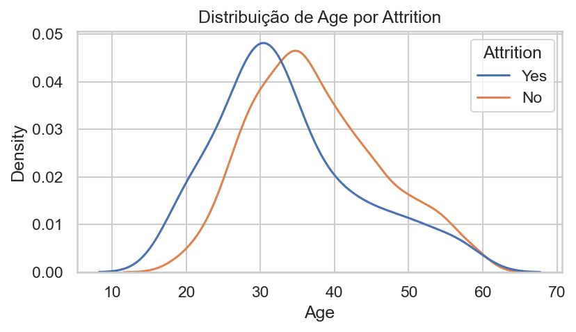
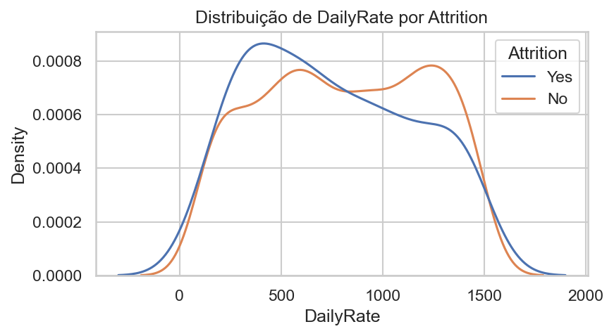
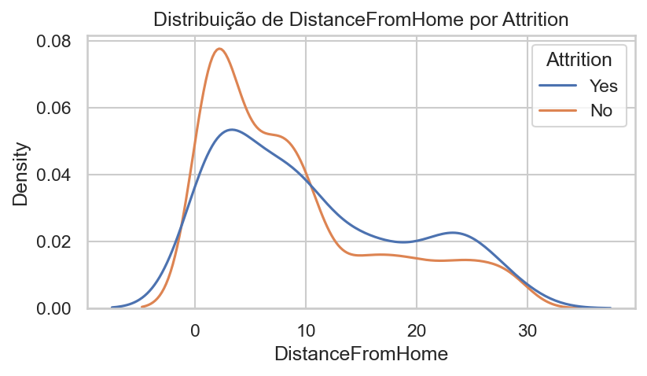
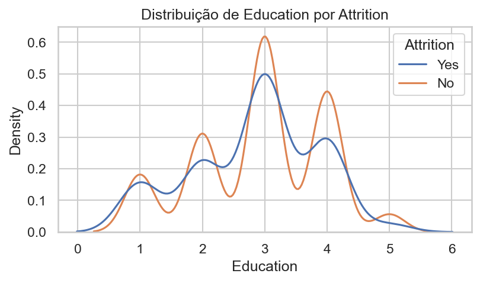
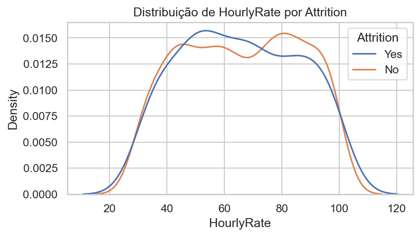
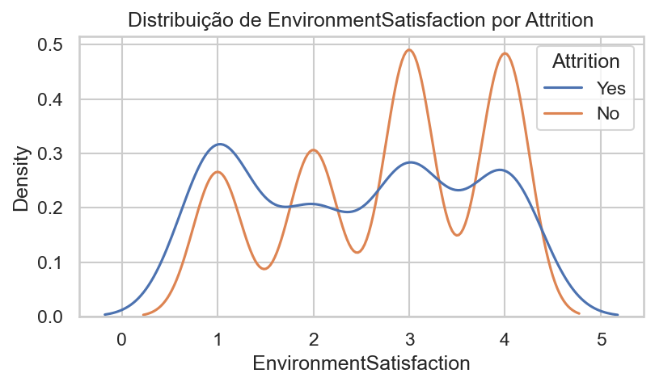

Padrões típicos a investigar (validar visualmente nas figuras):
- Se `DistanceFromHome` mostrar caudas maiores para quem saiu → pode ser feature de peso no re-treino.
- Distribuições quase sobrepostas indicam baixo poder discriminativo isolado → reforça necessidade de combinação multivariada.

Próximas análises sugeridas:
1. Plot de importância baseada em permutação (mesmo para KNN, via queda de métrica) para hierarquizar atributos.
2. SHAP Kernel / LIME em subconjunto para explicar proximidades locais.
3. Analisar distribuições pós normalização para confirmar ausência de escalas dominantes.

---

## Limitações das Visualizações Atuais

| Limitação | Impacto | Mitigação |
|-----------|---------|-----------|
| Falta de escala / legendas quantitativas nas figuras (não embutidas aqui) | Interpretação subjetiva | Incluir captions com valores-chave extraídos programaticamente |
| Ausência de curva Precision-Recall com pontos marcados | Dificulta escolha operacional de threshold | Gerar tabela (threshold, precision, recall, F1) |
| PCA apenas 2 componentes | Pode omitir separação em componentes superiores | Avaliar 3D ou variância explicada cumulativa |
| Sem análise de densidade dos vizinhos | Não quantifica sparsity da classe 1 | Calcular média de distância ao k-ésimo vizinho por classe |

---

## Checklist de Qualidade (Visualizações)

| Item | Status |
|------|--------|
| Desbalanceamento alvo evidenciado | OK |
| Matriz de confusão interpretada | OK |
| Curvas ROC & PR incluídas | OK |
| Projeção PCA descrita | OK |
| Correlação comentada | OK |
| Univariadas interpretadas | OK |
| Limitações explicitadas | OK |
| Recomendações acionáveis | OK |

---

## Próximos Passos Visual

1. Gerar curva Precision-Recall anotada com 5 thresholds estratégicos.
2. Produzir gráfico de importância por permutação para top 15 features.
3. Adicionar tabela (threshold, recall, precision, F1) → decisão orientada por KPI.
4. Criar heatmap de distâncias médias intra/inter-classe (diagnóstico de separabilidade local).
5. Incorporar gráfico de distribuição de probabilidades (histograma de `predict_proba` para classe 1) antes de ajuste de threshold.

> Este documento interpreta as imagens disponíveis sem introduzir números inexistentes; quando dados quantitativos adicionais forem calculados, podem ser incorporados nas seções correspondentes.

