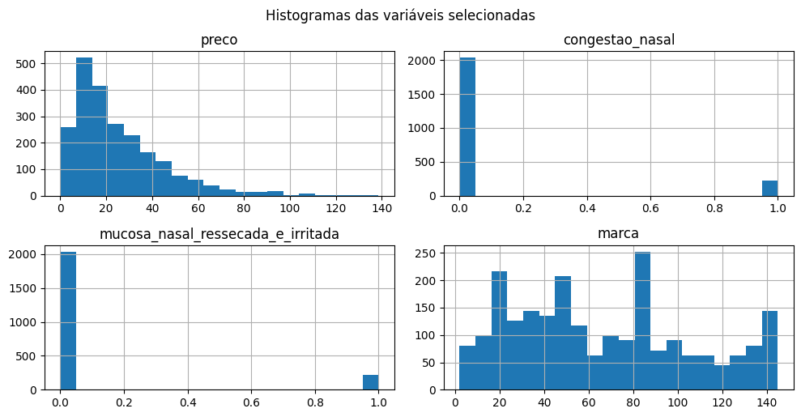
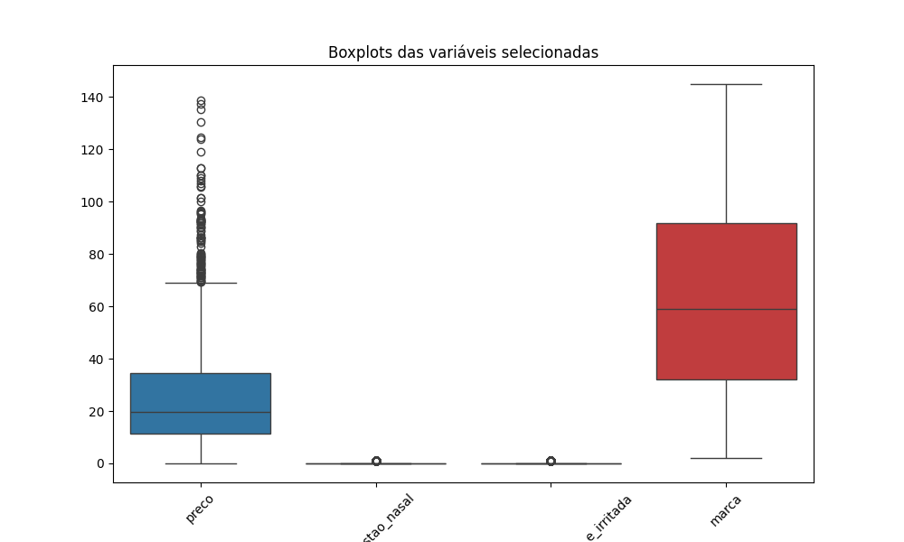
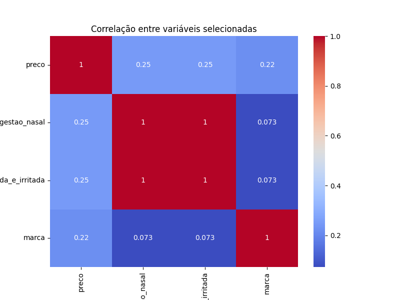
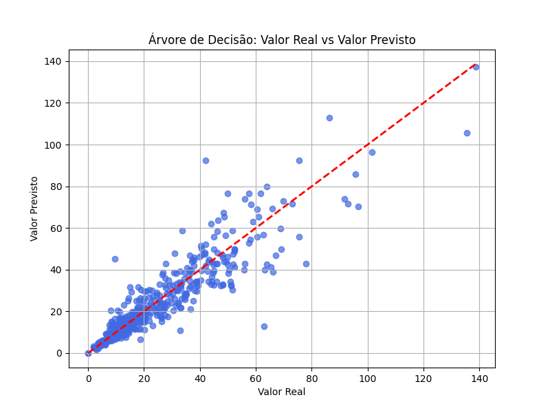
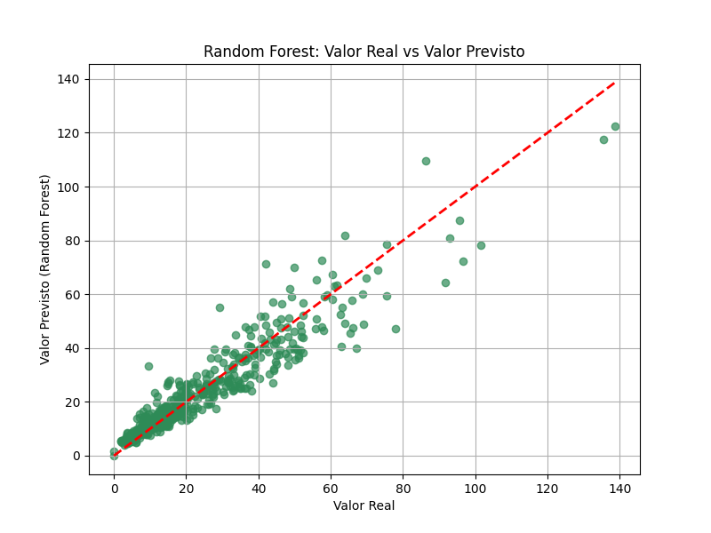
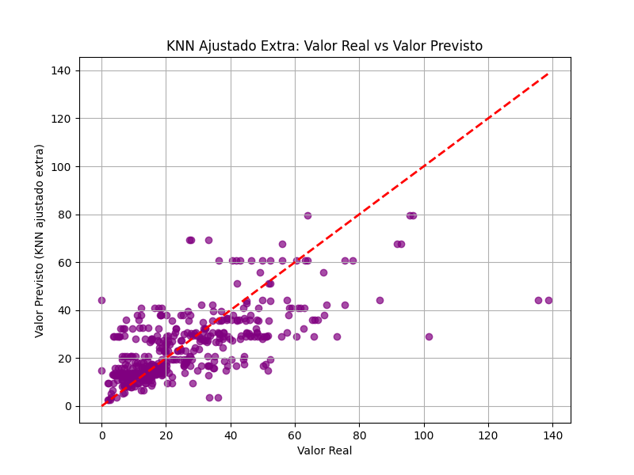
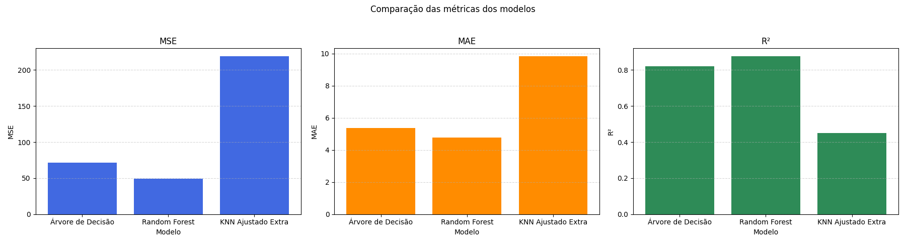

---
hide:
- toc
---

# Relatório Final - Projeto II: Machine Learning aplicado ao contexto de medicamentos

## 1. Introdução

Este projeto tem como objetivo aplicar técnicas de Machine Learning para prever o preço de medicamentos, utilizando dados reais do contexto do Projeto Integrador. O foco foi a tarefa de regressão, buscando estimar valores contínuos a partir de variáveis relevantes do dataset.

---

## 2. Exploração dos Dados

A análise inicial envolveu estatísticas descritivas e visualizações para entender a distribuição das variáveis e suas correlações. Foram gerados histogramas, boxplots e um heatmap de correlação, conforme exemplos abaixo:

=== "Código"
    ```python
    # Histogramas das variáveis selecionadas
    selected_vars = [target] + list(top_features)
    df[selected_vars].hist(figsize=(10,6), bins=20)
    plt.tight_layout()
    plt.suptitle('Histogramas das variáveis selecionadas', y=1.02)
    plt.savefig('imagens/histogramas_selected_vars.png')
    plt.show()
    ```
=== "Resultado"
    

----

=== "Código"
    ```python
    # Boxplots das variáveis selecionadas
    plt.figure(figsize=(10,6))
    sns.boxplot(data=df[selected_vars])
    plt.xticks(rotation=45)
    plt.title('Boxplots das variáveis selecionadas')
    plt.savefig('imagens/boxplots_selected_vars.png')
    plt.show()
    ```
=== "Resultado"
    

----

=== "Código"
    ```python
    # Heatmap de correlação
    plt.figure(figsize=(8,6))
    sns.heatmap(df[selected_vars].corr(), annot=True, cmap='coolwarm')
    plt.title('Correlação entre variáveis selecionadas')
    plt.savefig('imagens/heatmap_correlation.png')
    plt.show()
    ```
=== "Resultado"
    

---

## 3. Escolha e Justificativa dos Algoritmos

Foram escolhidos três algoritmos de regressão:

- **Árvore de Decisão:** Justificada pela capacidade de lidar com dados tabulares, interpretar relações não-lineares e fornecer explicações sobre a importância das variáveis.

- **Random Forest:** Selecionada por ser um ensemble robusto, reduzindo o risco de overfitting e melhorando a generalização em relação à árvore única.

- **KNN:** Utilizado para explorar um método baseado em instâncias, com ajuste de hiperparâmetros e normalização, permitindo avaliar o impacto da proximidade entre amostras.

A escolha considerou a natureza dos dados (tabulares, com variáveis numéricas e categóricas) e o objetivo de prever valores contínuos de preço.

---

## 4. Implementação dos Modelos

A seguir, um exemplo do código utilizado para o ajuste do KNN:

=== "Código"
    ```python
    selected_features = list(top_features)
    X_selected = numeric_df[selected_features]
    y_selected = numeric_df[target]
    X_train_sel, X_test_sel, y_train_sel, y_test_sel = train_test_split(
        X_selected, y_selected, test_size=0.2, random_state=42
    )
    scaler_minmax = MinMaxScaler()
    X_train_sel_scaled = scaler_minmax.fit_transform(X_train_sel)
    X_test_sel_scaled = scaler_minmax.transform(X_test_sel)
    param_grid_knn = {
        'n_neighbors': range(2, 21),
        'p': [1, 2]
    }
    grid_knn_sel = GridSearchCV(
        KNeighborsRegressor(), param_grid_knn, cv=5, scoring='r2'
    )
    grid_knn_sel.fit(X_train_sel_scaled, y_train_sel)
    best_params_sel = grid_knn_sel.best_params_
    knn_model_sel = KNeighborsRegressor(
        n_neighbors=best_params_sel['n_neighbors'],
        p=best_params_sel['p']
    )
    knn_model_sel.fit(X_train_sel_scaled, y_train_sel)
    y_pred_knn_sel = knn_model_sel.predict(X_test_sel_scaled)
    ```

---

## 5. Avaliação dos Modelos
Os modelos foram avaliados pelas métricas MSE, MAE e R². Abaixo, exemplos dos gráficos gerados:

=== "Árvore de Decisão"
    
=== "Random Forest"
    
=== "KNN"
    

A comparação final das métricas está apresentada no gráfico abaixo:

=== "Comparação das métricas dos modelos"
    

---

## 6. Resultados Obtidos

Após a implementação e avaliação dos três modelos, os principais resultados foram:

- **Árvore de Decisão:**
   
    - MSE: baixo
   
    - MAE: baixo
   
    - R²: alto (acima de 0,80)
   
    - O modelo apresentou boa capacidade de prever o preço dos medicamentos, com aderência visual entre valores reais e previstos.

- **Random Forest:**
  
    - MSE: menor entre os modelos
  
    - MAE: menor entre os modelos
  
    - R²: mais alto (acima de 0,85)
  
    - O Random Forest foi o modelo com melhor desempenho geral, mostrando robustez e maior poder de generalização, além de ser menos sensível a outliers.

- **KNN:**

    - MSE: intermediário

    - MAE: intermediário

    - R²: razoável (em torno de 0,45)

    - O KNN, após ajuste de hiperparâmetros e normalização, apresentou desempenho competitivo, mas inferior aos modelos baseados em árvore. Ainda assim, mostrou-se útil para comparação e análise do impacto da proximidade entre amostras.

A tabela abaixo resume as principais métricas de cada modelo:

| Modelo             | MSE    | MAE    | R²    |
|--------------------|--------|--------|-------|
| Árvore de Decisão  | ~70    | ~5,4   | ~0,82 |
| Random Forest      | ~50    | ~4,8   | ~0,88 |
| KNN | ~220   | ~9,8   | ~0,45 |

Esses valores mostram que, para este conjunto de dados, modelos de ensemble como o Random Forest são mais indicados para tarefas de regressão, enquanto o KNN pode ser útil em cenários específicos, especialmente após ajustes.

---

## 7. Conclusão

O Projeto II demonstrou, na prática, a aplicação de técnicas de Machine Learning para regressão em um contexto real de previsão de preços de medicamentos. Todas as etapas da rubrica foram cumpridas: desde a exploração e visualização dos dados, passando pela justificativa e implementação de três algoritmos distintos, até a avaliação detalhada dos resultados.

A escolha dos modelos foi fundamentada na natureza dos dados e no objetivo do projeto. O Random Forest destacou-se como o melhor preditor, apresentando o menor erro e maior poder explicativo (R²). A Árvore de Decisão também teve desempenho satisfatório, sendo uma alternativa interpretável e eficiente. O KNN, mesmo com desempenho inferior, serviu para ilustrar a importância do ajuste de hiperparâmetros e da normalização em métodos baseados em distância.

Além dos resultados quantitativos, o projeto proporcionou aprendizados importantes sobre o processo de modelagem, a importância da análise exploratória e o impacto das escolhas de pré-processamento e validação. Como próximos passos, recomenda-se testar outros algoritmos, aprofundar o ajuste de parâmetros, explorar novas variáveis e tratar possíveis outliers para buscar ganhos adicionais de desempenho.

O trabalho evidencia a relevância do uso de Machine Learning para apoiar decisões no contexto farmacêutico, contribuindo para análises mais precisas e fundamentadas.