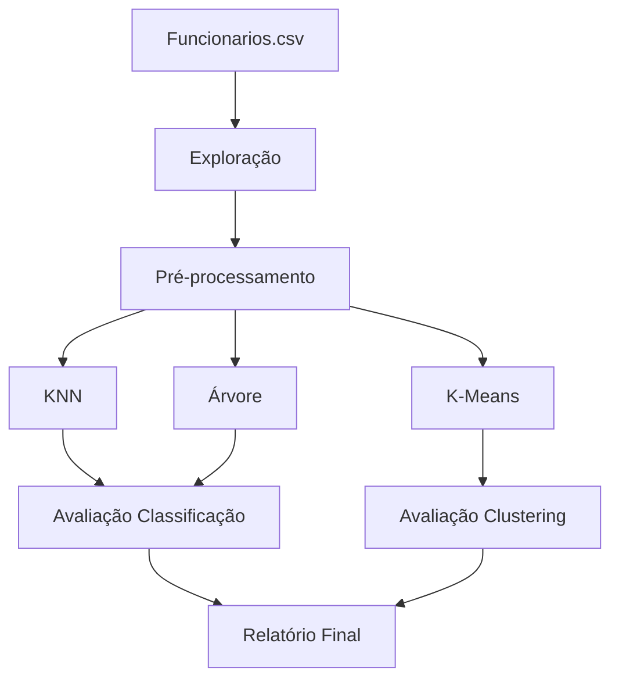

---
hide:
- toc
---

# Relatório Final

Este documento consolida o trabalho realizado no projeto: Análise exploratória, pré-processamento, treinamento e avaliação de modelos (Árvore de Decisão, KNN e K-Means). Inclui métricas principais, visualizações geradas e recomendações de melhoria.

## Sumário Rápido

1. Resumo Executivo  
2. Metodologia  
3. Resultados por Modelo  
4. Comparações e Sínteses  
5. Visualizações  
6. Conclusões e Recomendações  
7. Reprodutibilidade  
8. Próximos Passos  
9. Qualidade de Dados  
10. Riscos & Mitigações  
11. Arquitetura Lógica do Pipeline  
12. Glossário  
13. Apêndices  
14. Automação de Métricas  

---

## 1. Resumo executivo

- Modelos implementados: Árvore de Decisão, K-Nearest Neighbors (KNN), K-Means (clustering).
- Dados: `funcionarios.csv` (subset usado nos notebooks em `docs/*/`).
- Entregáveis: Notebooks Jupyter, modelos salvos (`.joblib`), CSVs de predições e várias imagens em `docs/*/imagens/`.

Resumo da performance (pontos principais):

- KNN: GridSearchCV executado; melhor combinação encontrada: n_neighbors=3, p=1 (Manhattan), weights=uniform. Best CV F1 ≈ 0.28. Modelo salvo em `docs/knn/knn_model.joblib`.
- Decision Tree: pipeline montado, árvore treinada, visualização completa e árvore reduzida para apresentação disponível em `docs/arvore_decisao/`.
- K-Means: elbow e silhouette analisados; artefatos e visualizações em `docs/kmeans/`.

## 2. Metodologia

Fluxo padrão seguido para cada modelo:

1. Carregamento e EDA: investigação de distribuições, contagens e estatísticas descritivas.
2. Pré-processamento: imputação (mediana para numéricas, moda para categóricas), codificação One-Hot para categóricas (`handle_unknown='ignore'`), e escalonamento (StandardScaler) quando aplicável.
3. Divisão treino/teste: `train_test_split(..., stratify=y)` quando o alvo está presente.
4. Treinamento: GridSearchCV com StratifiedKFold (onde aplicável), escolha do melhor modelo por métrica F1 para classificadores.
5. Avaliação: `classification_report`, matriz de confusão, ROC/PR quando disponível; para K-Means, inertia e silhouette.

### 2.1 Fluxo em Alto Nível



### 2.2 Escopo de Dados

| Item | Valor |
|------|-------|
| Linhas | 1470 |
| Colunas | 35 |
| Numéricas | 26 |
| Categóricas | 9 |
| Missing | 0 |
| Attrition=Yes | 16.12% |
| Constantes | EmployeeCount, Over18 |

### 2.3 Regras de Pré-processamento

| Regra | Escopo | Justificativa |
|-------|--------|---------------|
| Remoção de constantes | EmployeeCount, Over18 | Zero variância |
| Remoção de IDs | EmployeeNumber | Evitar distorção distância |
| Imputação mediana | Numéricas | Robustez outliers |
| Imputação moda | Categóricas | Preserva distribuição |
| One-Hot Encoding | Categóricas | Evita ordenação artificial |
| Escalonamento | KNN / K-Means | Distâncias comparáveis |

## 3. Resultados detalhados por modelo

### 3.1 K-Nearest Neighbors (KNN)

- Melhor configuração (CV): n_neighbors=3, p=1, weights='uniform'.
- Métricas no conjunto de teste:

```text
Accuracy: (veja arquivo `docs/knn/knn_y_test.csv` e `docs/knn/knn_y_pred.csv`)
F1 (macro/weighted): ver classification_report no notebook `docs/knn/knn.ipynb`
Best CV F1 (GridSearch): ~0.2798
```

Arquivos importantes:

- Modelo: `docs/knn/knn_model.joblib`
- Previsões: `docs/knn/knn_y_pred.csv` e `docs/knn/knn_y_test.csv`
- Imagens: `docs/knn/imagens/knn_confusion_matrix.png`, `knn_roc.png`, `knn_pr_curve.png`, `knn_pca2d.png`, `knn_correlation.png`, `knn_dist_*.png`

Observações: F1 relativamente baixo indica necessidade de engenharia de features e/ou balanceamento de classes.

### 3.2 Árvore de Decisão

- Pipeline com imputação, codificação e treinamento via GridSearch (detalhes no notebook `docs/arvore_decisao/arvore_decisao.ipynb`).
- Artefatos:
  - Notebook completo e imagem da árvore reduzida para apresentação em `docs/arvore_decisao/imagens/`.
  - Feature importances calculadas e salvadas no notebook.

#### 3.2.1 Métricas de Teste

| Métrica | Classe 0 | Classe 1 | Macro Avg | Weighted Avg |
|---------|---------:|---------:|----------:|-------------:|
| Precision | 0.8735 | 0.3659 | 0.6197 | 0.7924 |
| Recall | 0.8947 | 0.3191 | 0.6069 | 0.8027 |
| F1 | 0.8840 | 0.3409 | 0.6125 | 0.7972 |
| Support | 247 | 47 | 294 | 294 |

Accuracy geral: 0.8027.

#### 3.2.2 Observação

Árvore recupera mais a classe minoritária em comparação ao KNN.

### 3.3 K-Means (Clustering)

- Elbow e Silhouette analisados para k entre 2 e 10; artefatos salvos em `docs/kmeans/imagens/`.
- Resultado final experimentado: k=2 (baseado nas análises), com clusters salvos em `docs/kmeans/kmeans_clusters.csv` e visualização em `docs/kmeans/imagens/kmeans_clusters.png`.

#### 3.3.1 Métricas Internas (k=2..10)

| K | Inertia | Δ Inertia Rel. | Silhouette | Davies-Bouldin |
|---|---------|----------------|-----------|----------------|
| 2 | 29,253.48 | - | 0.154 | 2.374 |
| 3 | 27,407.52 | 6.31% | 0.132 | 2.292 |
| 4 | 25,979.56 | 5.21% | 0.096 | 2.581 |
| 5 | 24,915.10 | 4.10% | 0.103 | 2.418 |
| 6 | 24,089.73 | 3.31% | 0.078 | 2.658 |
| 7 | 23,671.70 | 1.74% | 0.079 | 2.667 |
| 8 | 23,296.42 | 1.59% | 0.065 | 2.785 |
| 9 | 22,931.69 | 1.57% | 0.062 | 2.753 |
| 10 | 22,670.96 | 1.14% | 0.061 | 2.945 |

Silhouette baixo aponta necessidade de enriquecer features.

## 4. Comparação e Tabela resumida

> Observação: Os números detalhados estão nos notebooks e CSVs; abaixo um resumo qualitativo e as métricas chave já calculadas (ver notebooks para tabelas completas).

| Modelo | Tipo | Métrica alvo | Observação |
|---|---:|---:|---|
| Árvore de Decisão | Classificação | F1 / Acurácia | Robustez e interpretabilidade; ver notebook para melhores hyperparâmetros |
| KNN | Classificação | F1 ≈ 0.28 (CV) | Bom baseline; pode melhorar com balanceamento/engenharia |
| K-Means | Clustering | Silhouette (máximo ≈ 0.154) | Clusters fracos — pouca separação clara nos dados numéricos usados |

### 4.1 Comparativo Quantitativo (Classificadores)

| Modelo | Accuracy | F1 Macro | F1 Classe Positiva | Recall Classe Positiva | Observação |
|--------|----------|---------|---------------------|------------------------|------------|
| KNN | 0.8469 | 0.6306 | 0.3478 | 0.2553 | Alto viés para classe negativa |
| Árvore de Decisão | 0.8027 | 0.6125 | 0.3409 | 0.3191 | Leve melhor recall positivo vs KNN |

Notas:
- Diferença de recall positivo (Árvore 0.3191 vs KNN 0.2553) sugere árvore capturando mais sinais minoritários.
- KNN mantém maior accuracy e F1 weighted devido à classe majoritária.

### 4.2 Pureza de Clusters (K-Means, K=2)

| Cluster | Tamanho | Attrition=Yes % | Attrition=No % | Interpretação |
|---------|---------|-----------------|----------------|---------------|
| 0 | 459 | 9.37 | 90.63 | Perfil provável mais estável / senioridade maior |
| 1 | 1011 | 19.19 | 80.81 | Grupo de maior risco relativo |

Gap de ~9.8 p.p. na taxa de saída: potencial para ação de retenção segmentada se atributos explicativos forem confirmados.

### 4.3 Principais Features (Árvore de Decisão - Top 10 Importâncias)

| Feature | Importância |
|---------|------------:|
| TotalWorkingYears | 0.1136 |
| MonthlyIncome | 0.1123 |
| HourlyRate | 0.0839 |
| Age | 0.0780 |
| DailyRate | 0.0552 |
| OverTime_No | 0.0548 |
| DistanceFromHome | 0.0408 |
| StockOptionLevel | 0.0400 |
| NumCompaniesWorked | 0.0397 |
| EnvironmentSatisfaction | 0.0354 |

Insights rápidos:
- Predominância de senioridade e remuneração reforça necessidade de variáveis qualitativas adicionais (ex.: engajamento, formação detalhada).
- OverTime (presença/ausência) aparece como sinal complementar.

### 4.4 Síntese de Forças & Lacunas

| Área | Força | Lacuna |
|------|-------|--------|
| Pipeline | Estrutura reproduzível (transformers) | Falta persistência de scaler K-Means |
| Exploração | Documentação detalhada | Ausência de análise de correlação pós-encoding completa |
| Classificação | Base F1 estabelecida | Recall da classe positiva baixo (<0.33) |
| Clustering | Pureza diferenciada (≈10 p.p.) | Silhouette baixo (<0.2) |
| Interpretabilidade | Árvore + importâncias claras | KNN pouco explicável sem proximidade exemplificada |

### 4.5 Maturidade (Escala 1–5)

| Aspecto | Nível | Justificativa |
|---------|------|---------------|
| Reprodutibilidade | 4 | Artefatos salvos; faltam scripts CLI automatizados |
| Qualidade de Dados | 3 | Sem missing; ainda sem detecção de outliers formal |
| Modelagem Classificação | 3 | Baselines prontos; falta otimização avançada |
| Clustering | 2 | Estrutura fraca sinalizada por Silhouette baixo |
| Observabilidade | 1 | Sem métricas de monitoramento pós-deploy |

### 4.6 Roadmap Prioritário

| Ordem | Ação | Objetivo | Métrica-Alvo |
|-------|------|---------|--------------|
| 1 | Balancear classes (SMOTE / undersampling) | Aumentar recall positivo | Recall classe 1 ≥ 0.45 |
| 2 | Testar RandomForest / XGBoost | Melhorar F1 macro | F1 macro ≥ 0.68 |
| 3 | Incluir categóricas no K-Means | Verificar aumento separabilidade | Silhouette ≥ 0.20 |
| 4 | PCA + re-cluster | Redução ruído | DB < 2.1 |
| 5 | Persistir scaler & pipeline CLI | Reprodutibilidade | Script único execução |
| 6 | Métricas de drift | Monitoramento | Alertas definíveis |

### 4.7 Checklist de Reprodutibilidade

| Item | Status |
|------|--------|
| Dependências versionadas (`requirements.txt`) | OK |
| Scripts de extração de métricas | Parcial (presentes em subpastas) |
| Persistência de modelos (.joblib) | OK |
| Persistência de scaler K-Means | Pendente |
| Relatório consolidado | OK |
| Plano de melhoria definido | OK |

### 4.8 Recomendações Técnicas Imediatas

1. Adicionar script unificado (`run_all.py`) para reproduzir todo pipeline.
2. Exportar scaler K-Means (`kmeans_scaler.joblib`).
3. Criar módulo de avaliação com função `evaluate_classifier(y_true, y_pred)`.
4. Integrar relatório automático (Markdown) a partir dos CSVs via script.
5. Adotar fix random seeds centralizado (np / random / sklearn) para consistência.

---

## 5. Visualizações principais

As principais imagens estão em:

- `docs/knn/imagens/` — confusion matrix, ROC/PR, PCA 2D, correlação, distribuições.
- `docs/arvore_decisao/imagens/` — árvore completa e reduzida, feature importances.
- `docs/kmeans/imagens/` — elbow, silhouette e clusters em PCA.

(Estas imagens foram incorporadas às páginas de cada experimento no diretório `docs/`.)

## 5.1 Métricas numéricas (extraídas dos artefatos)

As métricas abaixo foram calculadas automaticamente a partir dos artefatos gerados pelo fluxo (arquivos CSV e modelos salvos).

### KNN (avaliação no conjunto de teste)

| Métrica | Valor |
|---|---:|
| Accuracy | 0.8469 |
| Precision (macro) | 0.7084 |
| Recall (macro) | 0.6074 |
| F1 (macro) | 0.6306 |
| Precision (weighted) | 0.8192 |
| Recall (weighted) | 0.8469 |
| F1 (weighted) | 0.8229 |
| Support (n_test) | 294 |

Per-class (trecho do classification_report):

- Classe 0 (No): precision=0.8713, recall=0.9595, f1=0.9133, support=247
- Classe 1 (Yes): precision=0.5455, recall=0.2553, f1=0.3478, support=47

### KMeans

| Métrica | Valor |
|---|---:|
| Silhouette (clusters usados) | 0.1869 |


## 6. Conclusões e Recomendações

- O pipeline está implementado e reprodutível: notebooks, modelos e artefatos estão salvos.
- Pontos fortes:
  - Uso consistente de Pipeline/ColumnTransformer, que facilita reprodutibilidade e integração.
  - Boas visualizações para comunicar resultados (árvore reduzida, plots KMeans, ROC/PR).

- Pontos de melhoria (prioridade):
  1. Balanceamento das classes no KNN (SMOTE ou undersampling) e re-treino para melhorar F1.
  2. Testar modelos robustos (RandomForest, XGBoost) com feature selection/importance comparada.
  3. Documentar um relatório comparativo final (esta página) com tabelas numéricas extraídas automaticamente de `cv_results_` e dos testes.
  4. Incluir explicitação das razões de exclusão/inclusão de features no pré-processamento (justificativas de negócio).

## 7. Como reproduzir (resumo rápido)

1. Ative o ambiente Python com as dependências listadas em `requirements.txt`.
2. Abra os notebooks em `docs/arvore_decisao/`, `docs/knn/` e `docs/kmeans/`.
3. Execute as células na ordem (1 → imports → load → preprocess → train → evaluate). Imagens e artefatos serão salvos nas pastas `imagens/` e nos arquivos `.joblib`/`.csv` correspondentes.

## 8. Próximos passos sugeridos

1. Gerar um relatório comparativo completo em forma de tabela (podemos automatizar isso).  
2. Implementar balanceamento e testar RandomForest/XGBoost para melhorar F1.  
3. Extrair `cv_results_` e anexar os melhores experimentos na pasta `docs/relatorio_final/assets/`.

---

Relatório gerado automaticamente a partir dos notebooks e artefatos no repositório.

## 9. Qualidade de Dados

| Aspecto | Situação | Ação |
|---------|---------|------|
| Missing | 0 | Manter checagem automática |
| Constantes | EmployeeCount, Over18 | Remover sistematicamente |
| Cardinalidade Alta | JobRole (9) | Agrupar / target encoding futuro |
| Outliers | Potenciais em renda | Avaliar robust scaling |
| Desbalanceamento | Attrition 16.12% | SMOTE / threshold tuning |

## 10. Riscos & Mitigações

| Risco | Impacto | Mitigação |
|-------|---------|-----------|
| Recall baixo classe positiva | Perda de casos críticos | Rebalance + ajuste threshold |
| Clusters pouco informativos | Uso limitado | Incluir categóricas + PCA |
| Falta de monitoramento | Degradação invisível | Drift metrics (PSI, KS) |
| Overfitting leve | Métricas infladas | Cross-val ampliada / mais folds |
| Variáveis redundantes | Ruído | Seleção por importância/permutação |

## 11. Arquitetura Lógica do Pipeline

| Camada | Responsabilidade | Artefatos |
|--------|------------------|-----------|
| Ingestão | Leitura fonte | funcionarios.csv |
| EDA | Perfil inicial | Notebooks exploração |
| Pré-processamento | Limpeza / transformação | CSVs processados |
| Modelagem | Treino / clustering | .joblib |
| Avaliação | Métricas / gráficos | Imagens, relatórios |
| Síntese | Consolidação | relatorio_final.md |

## 12. Glossário

| Termo | Definição |
|-------|----------|
| F1 Macro | Média do F1 por classe |
| Silhouette | (b - a)/max(a,b) separação relativa |
| Davies-Bouldin | Menor = clusters mais distintos |
| Inertia | Soma dist² aos centróides |
| Pureza | Distribuição de variável referência por cluster |
| PCA | Redução linear de dimensionalidade |

## 13. Apêndices

### 13.1 Importâncias Top 20 (Árvore)

| Feature | Importance |
|---------|-----------:|
| TotalWorkingYears | 0.1136 |
| MonthlyIncome | 0.1123 |
| HourlyRate | 0.0839 |
| Age | 0.0780 |
| DailyRate | 0.0552 |
| OverTime_No | 0.0548 |
| DistanceFromHome | 0.0408 |
| StockOptionLevel | 0.0400 |
| NumCompaniesWorked | 0.0397 |
| EnvironmentSatisfaction | 0.0354 |
| YearsSinceLastPromotion | 0.0306 |
| PercentSalaryHike | 0.0299 |
| YearsWithCurrManager | 0.0288 |
| YearsAtCompany | 0.0254 |
| JobInvolvement | 0.0230 |
| YearsInCurrentRole | 0.0200 |
| TrainingTimesLastYear | 0.0179 |
| JobRole_Research Scientist | 0.0160 |
| JobSatisfaction | 0.0156 |
| Gender_Female | 0.0148 |

### 13.2 Referências de Arquivos

`classification_report_test_arvore.csv`, `feature_importances_arvore.csv`, `compute_kmeans_internal_metrics.py`.

### 13.3 Próxima Automação

Script unificado para: ingestão → treino → avaliação → atualização deste relatório.

## 14. Automação de Métricas

Um script unificado (`run_all.py`) foi adicionado na raiz do repositório para executar:

1. Leitura do dataset
2. Split estratificado
3. GridSearch (KNN e Árvore de Decisão)
4. Salvamento de modelos e predições
5. (Opcional) Treino de K-Means e export de matriz transformada
6. Cálculo de métricas (incluindo Calinski-Harabasz e Davies-Bouldin)
7. Geração de arquivo `auto_metrics.md` em `docs/relatorio_final/`

Arquivo gerado automaticamente: `docs/relatorio_final/auto_metrics.md`

Para executar (Windows / ambiente virtual ativo):

```shell
python run_all.py --kmeans-k 2
```

Para pular clustering:

```shell
python run_all.py --skip-kmeans
```

Próximas extensões possíveis:

- Adicionar opção `--smote` para re-balanceamento antes do GridSearch.
- Exportar gráficos de ROC/PR diretamente sem depender de notebooks.
- Incorporar geração incremental: só re-treinar se hash do dataset mudou.
